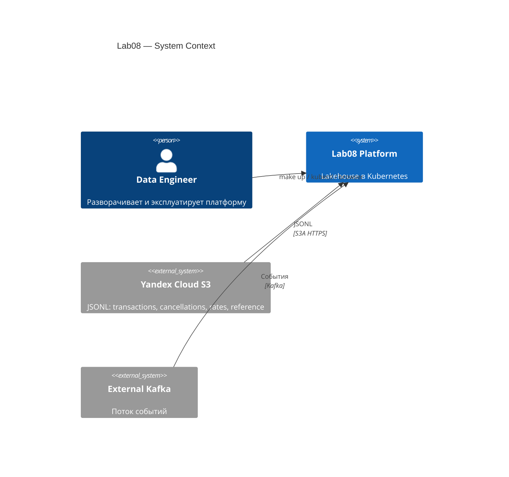
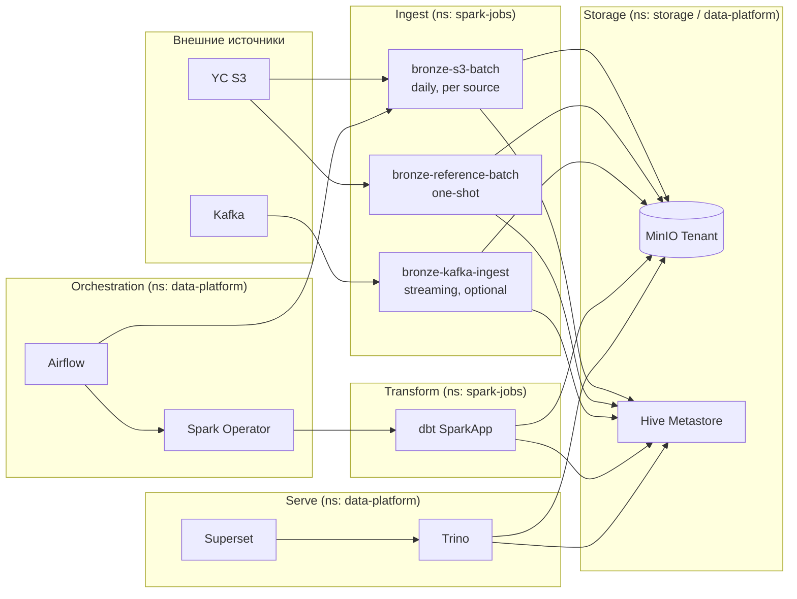
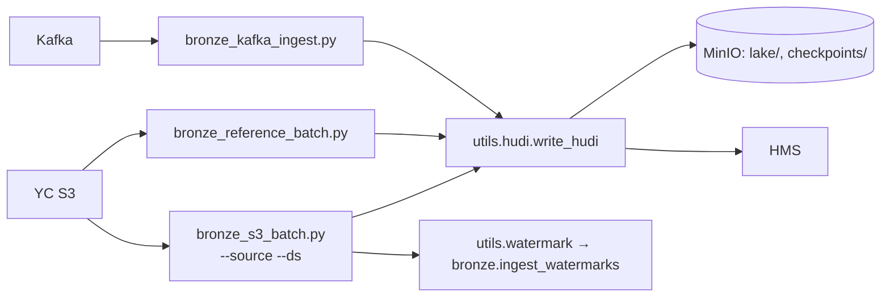
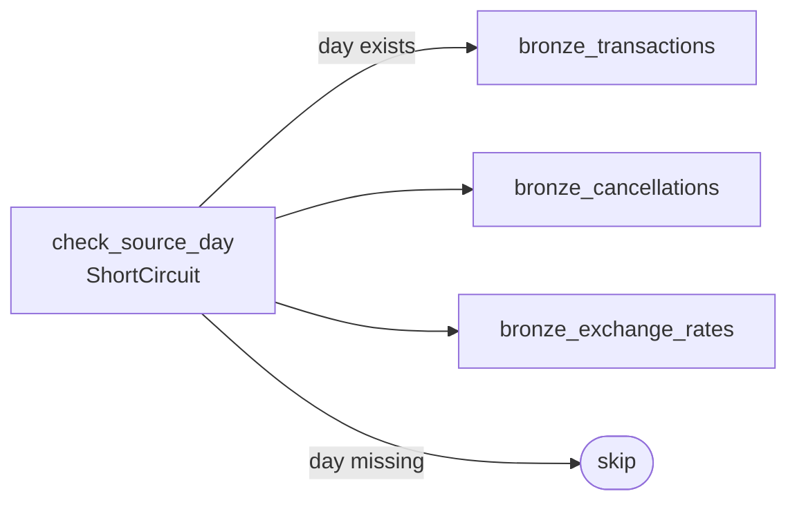
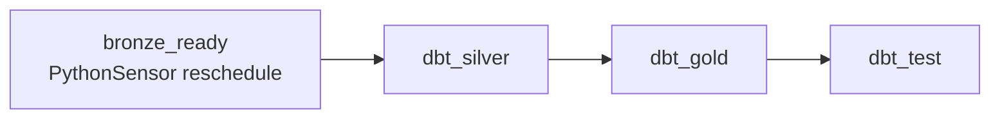
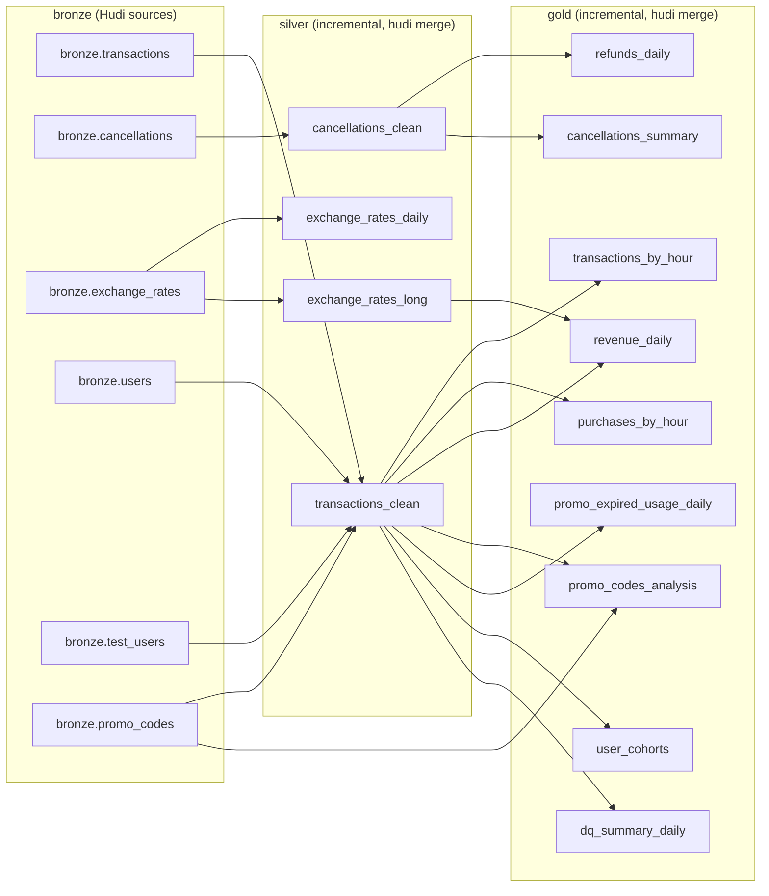
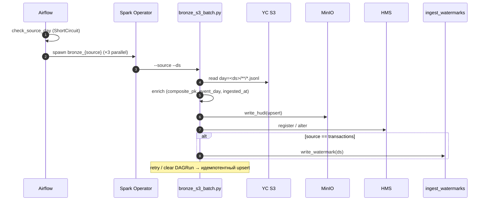
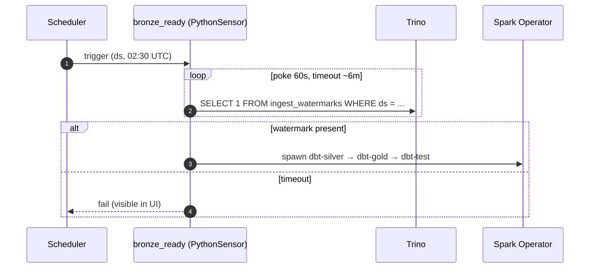
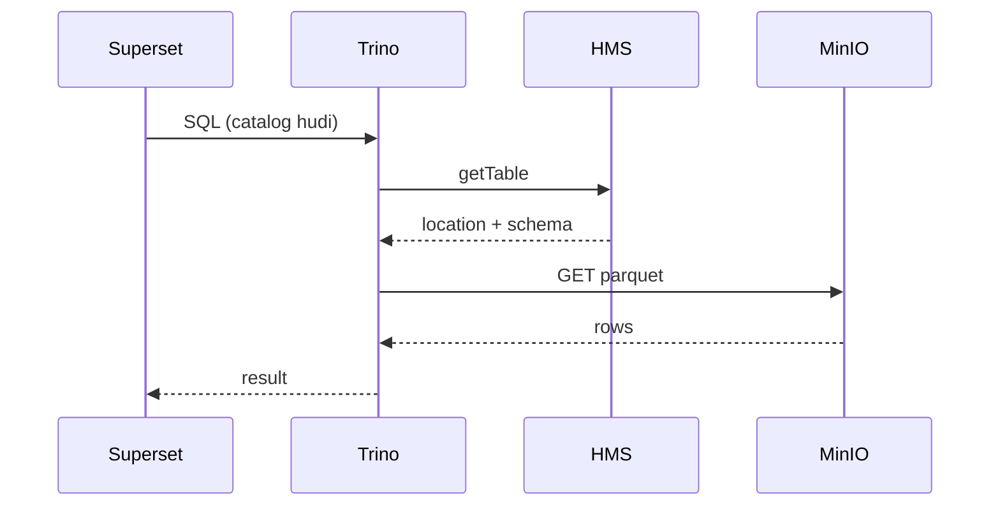

# Детальная архитектура

## Назначение

Lab08 — локально разворачиваемый лейкхаус для финтех-данных. Поднимается одной командой и закрывает полный цикл: ingest, хранение, трансформации, BI.

- **Источники данных:** JSONL-файлы из Yandex Cloud S3 (бакет `npl-de18-lab8-data`) и поток событий из внешней Kafka.
- **Хранилище:** Apache Hudi (Copy-on-Write) поверх MinIO, разложено по слоям `bronze / silver / gold`.
- **Трансформации:** dbt-spark, режим `session`, incremental-модели через Hudi `merge` (часть gold по cancellations — `materialized='table'`).
- **Каталог:** Hive Metastore с Postgres-бэкендом.
- **Чтение:** Trino 470 (read-only), Apache Superset 4.x для дашбордов.
- **Оркестрация:** Airflow 2.10.4 на `KubernetesExecutor`. Bronze S3 и медальон — посуточные DAG'и; Kafka — долгоживущий `SparkApplication` (speed-слой, опционально).
- **Метрики:** kube-prometheus-stack, Spark Prometheus servlet, statsd-exporter для Airflow.

Среда — Kubernetes (kind или Docker Desktop). Конфигурация декларативная: `helmfile.yaml` плюс raw-манифесты в `k8s/`.

---

## Контекст

На границе системы — два внешних источника данных и один пользователь, дата-инженер.

---

## Контейнеры

Платформа сгруппирована по логическим слоям. Полная карта компонентов с версиями приведена ниже, в таблице.

В диаграмме опущены вспомогательные связи (HMS → Postgres, Prometheus scraping, ingress) — они описаны в таблице протоколов.

### Состав

| Компонент | Версия | Namespace |
|---|---|---|
| ingress-nginx | 4.11.0 | `ingress-nginx` |
| MinIO Operator + Tenant | 6.0.4 | `minio-operator`, `storage` |
| HMS Postgres (Bitnami) | 15.5.38 | `data-platform` |
| Hive Metastore | 3.0.0 (raw manifest) | `data-platform` |
| Spark Operator | 1.4.6 | `data-platform` |
| Airflow | chart 1.15.0 (Airflow 2.10.4) | `data-platform` |
| Trino | chart 0.34.0 (v470) | `data-platform` |
| Superset | chart 0.13.2 (4.x) | `data-platform` |
| kube-prometheus-stack | 65.5.1 | `monitoring` |
| statsd-exporter | 0.13.0 | `monitoring` |

**Собственные образы:** `lab08/spark:3.5.8-hudi-1.1.1` (Spark + Hudi + Hadoop S3A + Kafka + dbt-spark 1.8.0 + код задач) и `lab08/airflow:2.10.4` (с провайдерами cncf-kubernetes, trino, statsd).

### Протоколы взаимодействия

| Источник → Приёмник | Протокол / формат | Аутентификация |
|---|---|---|
| Spark / Trino → MinIO | S3A HTTP / Parquet | secret `lab08-credentials` |
| Spark → YC S3 | S3A HTTPS / JSONL | Anonymous provider |
| Spark / Trino / dbt → HMS | Thrift | внутри кластера |
| HMS → Postgres | JDBC | `hive/hive` |
| Airflow → Spark Operator | K8s API (`SparkApplication` v1beta2) | SA `airflow` (RBAC в `k8s/airflow-rbac.yaml`) |
| Airflow → Trino | HTTP REST | connection `trino_default` |
| Superset → Trino | HTTP REST | DB connection |
| Spark → Kafka | Kafka | env `KAFKA_BOOTSTRAP_SERVERS / KAFKA_TOPIC` |
| Prometheus → Spark | HTTP `/metrics/prometheus/` | — |
| Airflow → StatsD | UDP 9125 | — |

---

## Компоненты

### Bronze ingest

Lambda-разделение: batch — источник истины, Kafka — speed-слой.

**S3 batch (`bronze_s3_batch.py`)** — один источник за одни сутки. CLI: `--source {transactions|cancellations|exchange_rates} --ds <YYYY-MM-DD> --src-root s3a://npl-de18-lab8-data`. Идемпотентный upsert по `composite_pk` (transactions) / `cancellation_id` / `rate_pk`. Watermark пишет **только** `transactions` — это снимает HMS race-condition при параллельном создании таблицы тремя подами.

**Reference (`bronze_reference_batch.py`)** — one-shot загрузка `users / test_users / promo_codes`. Запускается из `make up` через `make reference-batch`.

**Kafka (`bronze_kafka_ingest.py`)** — долгоживущий `SparkApplication` с `restartPolicy: Always`, `onFailureRetries: 10`. Чекпоинт на S3, exactly-once на уровне файлов через checkpoint + Hudi upsert. Dynamic allocation 1–2 executor. Запускается по необходимости (`make kafka-streaming-app`); основной аналитический контур работает без него.

### DAG `bronze_s3_ingest`

Расписание `0 2 * * *`, `start_date=2026-04-24`, `catchup=True`, `max_active_runs=1`, T-1 (грузит `ds = вчера`). `check_source_day` — ShortCircuit-гейт на наличие S3-партиции: если директории нет, слот сразу skipped без ретраев. Три bronze-таски запускаются параллельно одноразовыми `SparkApplication` через `SparkKubernetesOperator`.

Ресурсные профили per source (`_common.BRONZE_RESOURCE_PROFILES`):

| Источник | Driver | Executor | Instances |
|---|---|---|---|
| `transactions` | 1g + 256m | 1g + 512m | 2 (fixed) |
| `cancellations` | 512m + 128m | 512m + 256m | 1 |
| `exchange_rates` | 512m + 128m | 512m + 256m | 1 |

### DAG `transactions_medallion`

Расписание `30 2 * * *` (сдвиг даёт bronze ~30 мин на завершение). `bronze_ready` — `PythonSensor(mode=reschedule, poke=60s, timeout≈6m)` ждёт строку в `bronze.ingest_watermarks` за нужный `ds`. При таймауте DAGRun падает — видно в UI (без silent-skip).

Каждая dbt-таска поднимает одноразовый `SparkApplication` (`restartPolicy: Never`, `mainApplicationFile=local:///opt/spark/jobs/run_dbt.py`). dbt-проект — из ConfigMap `dbt-project` (`/tmp/cm`), код задач — из `spark-jobs-code` (`/opt/spark/jobs`). AWS-ключи прокидываются через `envSecretKeyRefs` из `lab08-credentials`.

### dbt-проект

Профиль `lab08`, адаптер `dbt-spark` 1.8.0 в режиме `method: session`. Дефолты: `materialized=incremental`, `file_format=hudi`, `incremental_strategy=merge`, `location_root=s3a://lake/{silver,gold}`. Базовая валюта (`vars.base_currency`) — `TGRK`. Витрины по cancellations (`cancellations_summary`, `refunds_daily`) — `materialized='table'` (десятки строк, безопаснее пересобирать целиком).

Hudi-настройки: `compression=zstd`, `clean.policy=KEEP_LATEST_COMMITS`, `commits.retained=2`, inline clustering на silver, column-stats индекс по `event_day, hour_of_day, is_test_user`.

В `transactions_clean` выставляются флаги качества: `is_user_missing`, `is_user_unknown`, `is_test_user`, `is_amount_invalid`, `is_revenue_eligible`, `is_promo_expired_at_use`.

**Проверки качества:** около 30 generic dbt-тестов (`unique`, `not_null`, `accepted_values`) в `_silver.yml`, `_gold.yml`, `sources.yml`, плюс 2 singular — recon bronze vs silver и orphan-rate cancellations.

---

## Сценарии работы

### Bronze ingest S3 → Hudi (daily batch)

### Ежедневные трансформации

### Чтение Superset → Trino → Hudi

