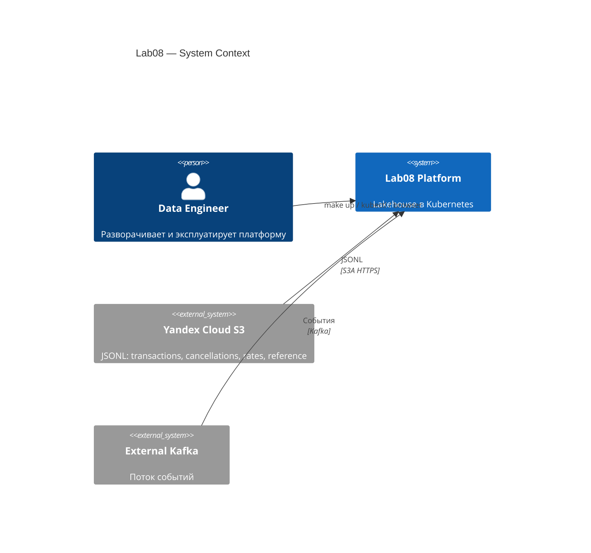
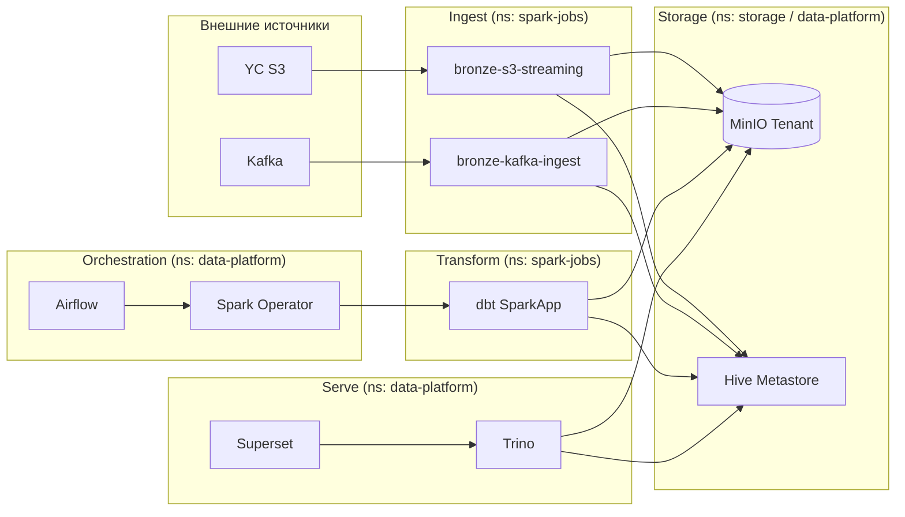
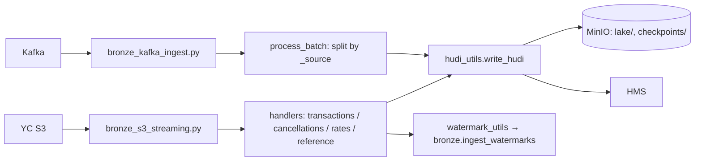
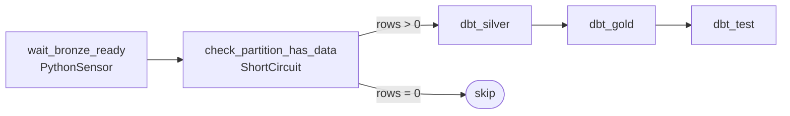
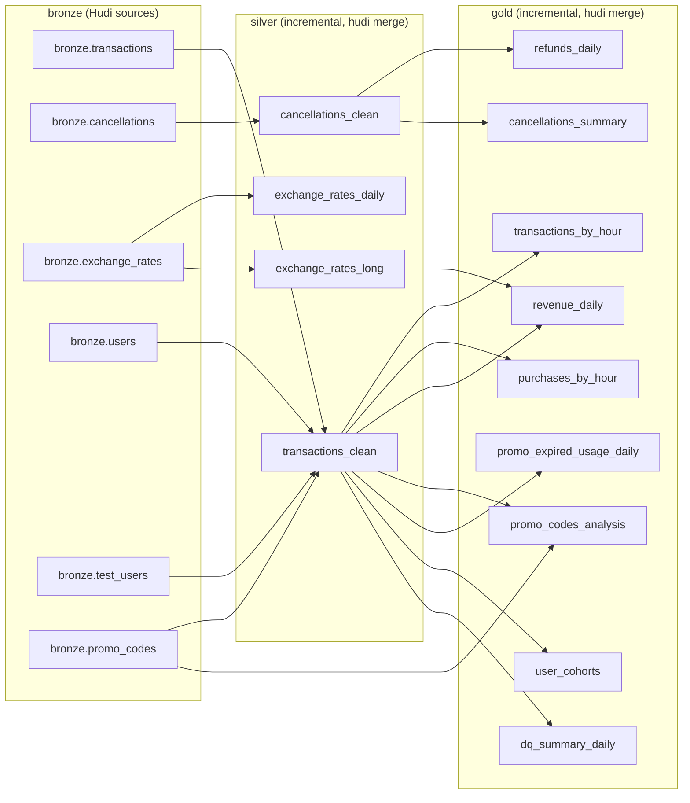
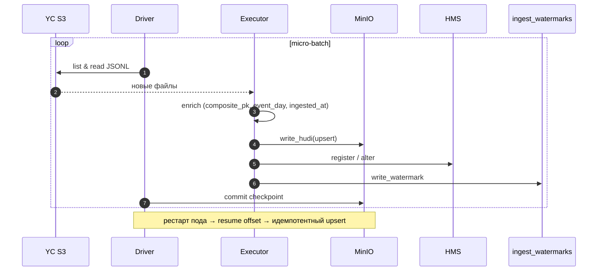
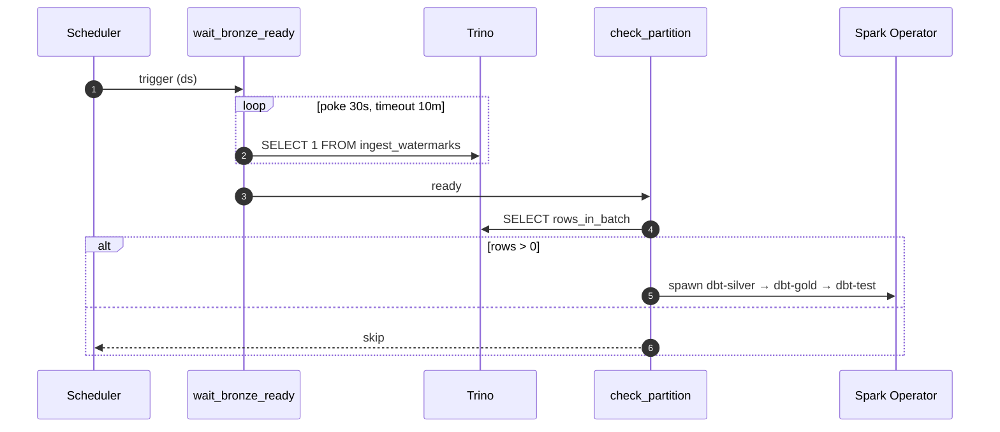
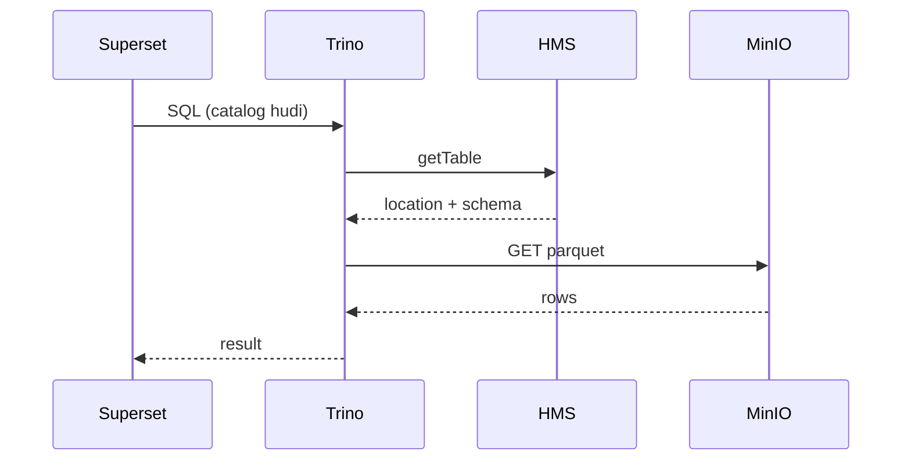

# Детальная архитектура

## Назначение

Lab08 — локально разворачиваемый лейкхаус для финтех-данных. Поднимается одной командой и закрывает полный цикл: ingest, хранение, трансформации, BI.

- **Источники данных:** JSONL-файлы из Yandex Cloud S3 (бакет `npl-de18-lab8-data`) и поток событий из внешней Kafka.
- **Хранилище:** Apache Hudi (Copy-on-Write) поверх MinIO, разложено по слоям `bronze / silver / gold`.
- **Трансформации:** dbt-spark, режим `session`, incremental-модели через Hudi `merge`.
- **Каталог:** Hive Metastore с Postgres-бэкендом.
- **Чтение:** Trino 470 (read-only), Apache Superset 4.x для дашбордов.
- **Оркестрация:** Airflow 2.10.4 на `KubernetesExecutor`. Стриминг — долгоживущие `SparkApplication` CRD.
- **Метрики:** kube-prometheus-stack, Spark Prometheus servlet, statsd-exporter для Airflow.

Среда — Kubernetes (kind или Docker Desktop). Конфигурация декларативная: `helmfile.yaml` плюс raw-манифесты в `k8s/`.

---

## Контекст

На границе системы — два внешних источника данных и один пользователь, дата-инженер.

---

## Контейнеры

Платформа сгруппирована по логическим слоям. Полная карта компонентов с версиями приведена ниже, в таблице.

В диаграмме опущены вспомогательные связи (HMS → Postgres, Prometheus scraping, ingress) — они описаны в таблице протоколов.

### Состав

| Компонент | Версия | Namespace |
|---|---|---|
| ingress-nginx | 4.11.0 | `ingress-nginx` |
| MinIO Operator + Tenant | 6.0.4 | `minio-operator`, `storage` |
| HMS Postgres (Bitnami) | 15.5.38 | `data-platform` |
| Hive Metastore | 3.0.0 (raw manifest) | `data-platform` |
| Spark Operator | 1.4.6 | `data-platform` |
| Airflow | chart 1.15.0 (Airflow 2.10.4) | `data-platform` |
| Trino | chart 0.34.0 (v470) | `data-platform` |
| Superset | chart 0.13.2 (4.x) | `data-platform` |
| kube-prometheus-stack | 65.5.1 | `monitoring` |
| statsd-exporter | 0.13.0 | `monitoring` |

**Собственные образы:** `lab08/spark:3.5.8-hudi-1.1.1` (Spark + Hudi + Hadoop S3A + Kafka + dbt-spark 1.8.0 + код задач) и `lab08/airflow:2.10.4` (с провайдерами cncf-kubernetes, trino, statsd).

### Протоколы взаимодействия

| Источник → Приёмник | Протокол / формат | Аутентификация |
|---|---|---|
| Spark / Trino → MinIO | S3A HTTP / Parquet | secret `lab08-credentials` |
| Spark → YC S3 | S3A HTTPS / JSONL | Anonymous provider |
| Spark / Trino / dbt → HMS | Thrift | внутри кластера |
| HMS → Postgres | JDBC | `hive/hive` |
| Airflow → Spark Operator | K8s API (`SparkApplication` v1beta2) | SA `airflow` (RBAC в `k8s/airflow-rbac.yaml`) |
| Airflow → Trino | HTTP REST | connection `trino_default` |
| Superset → Trino | HTTP REST | DB connection |
| Spark → Kafka | Kafka | env `KAFKA_BOOTSTRAP_SERVERS / KAFKA_TOPIC` |
| Prometheus → Spark | HTTP `/metrics/prometheus/` | — |
| Airflow → StatsD | UDP 9125 | — |

---

## Компоненты

### Стриминговый ingest

Оба `SparkApplication` запускаются с `restartPolicy: Always`, `onFailureRetries: 10`. Чекпойнты лежат на S3 — при рестарте пода обработка продолжается с того же места. Exactly-once на уровне файлов обеспечивается связкой checkpoint + Hudi upsert по `composite_pk` (или обычному PK). Dynamic allocation: 1–3 executor.

### DAG `transactions_pipeline`

Расписание: `0 2 * * *`. `start_date=2026-04-24`, `catchup=True`, `max_active_runs=1`.

`wait_bronze_ready` опрашивает `hudi.bronze.ingest_watermarks` через Trino (poke 30s, timeout 10m, mode=reschedule). `check_partition_has_data` пропускает downstream-таски, если в партиции нет строк.

Каждая dbt-таска поднимает одноразовый `SparkApplication` (`restartPolicy: Never`). `mainApplicationFile=local:///opt/spark/jobs/run_dbt.py`. dbt-проект подкладывается из ConfigMap `dbt-project` (mount `/tmp/cm`), код задач — из `spark-jobs-code` (mount `/opt/spark/jobs`). AWS-ключи прокидываются через `envSecretKeyRefs` из секрета `lab08-credentials`.

### dbt-проект

Профиль `lab08`, адаптер `dbt-spark` 1.8.0 в режиме `method: session`. Дефолты: `materialized=incremental`, `file_format=hudi`, `incremental_strategy=merge`, `location_root=s3a://lake/{silver,gold}`. Базовая валюта (`vars.base_currency`) — `TGRK`.

Hudi-настройки: `compression=zstd`, `clean.policy=KEEP_LATEST_COMMITS`, `commits.retained=2`, inline clustering на silver, column-stats индекс по `event_day, hour_of_day, is_test_user`.

В `transactions_clean` выставляются флаги качества: `is_user_missing`, `is_user_unknown`, `is_test_user`, `is_amount_invalid`, `is_revenue_eligible`, `is_promo_expired_at_use`.

**Проверки качества:** около 30 generic dbt-тестов (`unique`, `not_null`, `accepted_values`) в `_silver.yml`, `_gold.yml`, `sources.yml`, плюс 2 singular — recon bronze vs silver и orphan-rate cancellations.

---

## Сценарии работы

### Стриминговый ingest S3 → bronze

### Ежедневные трансформации

### Чтение Superset → Trino → Hudi

