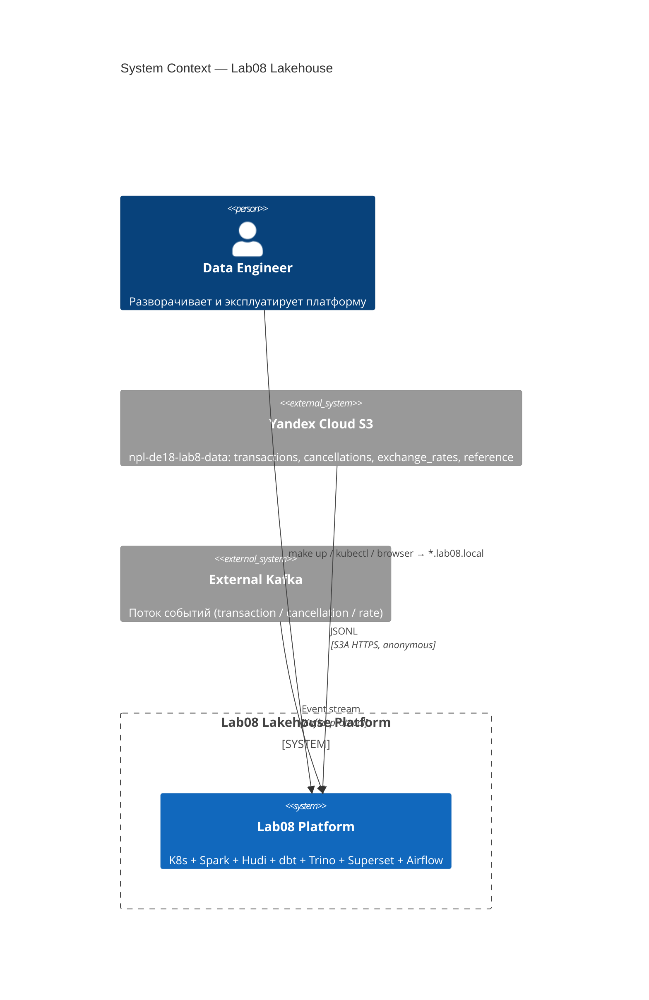
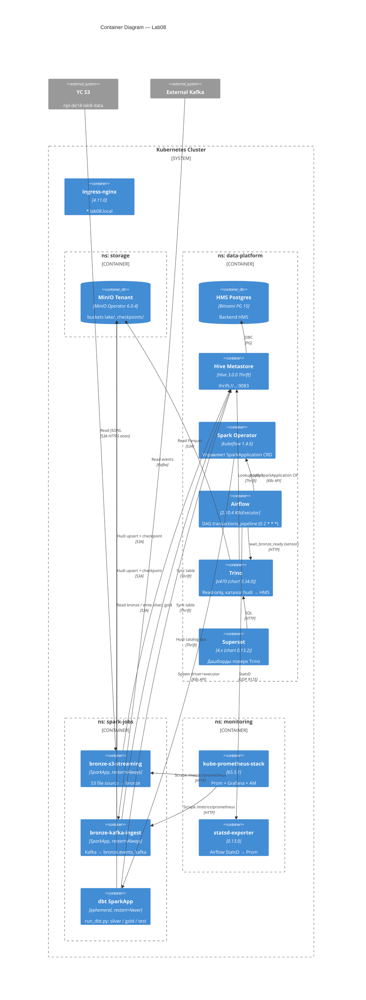
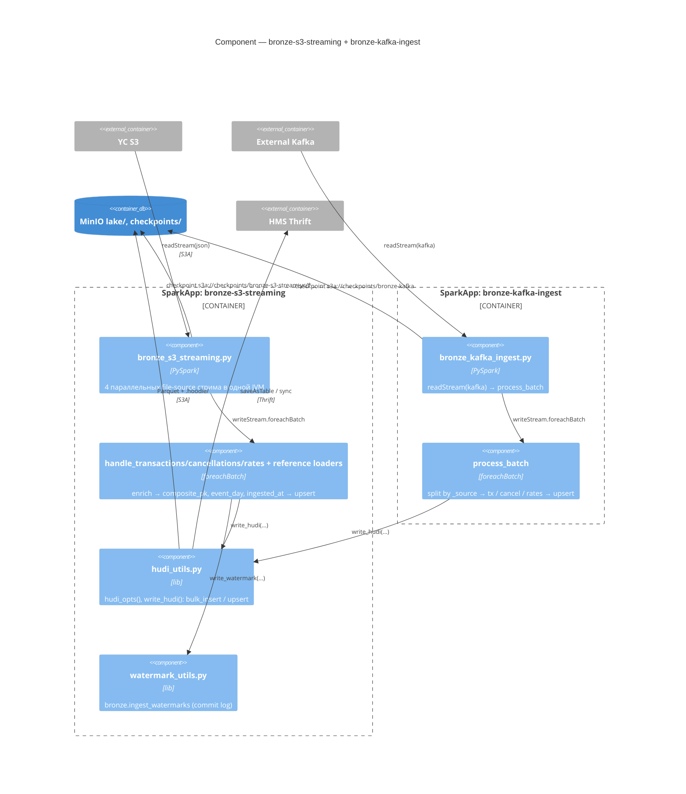
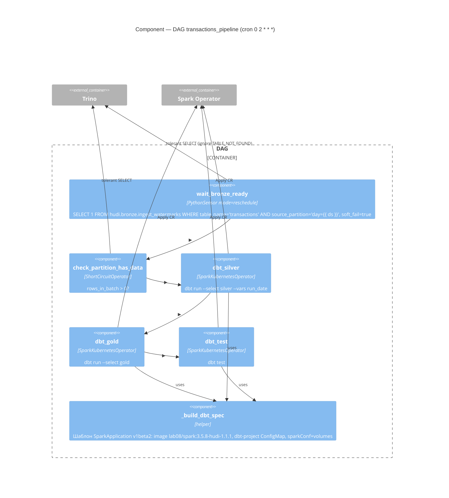
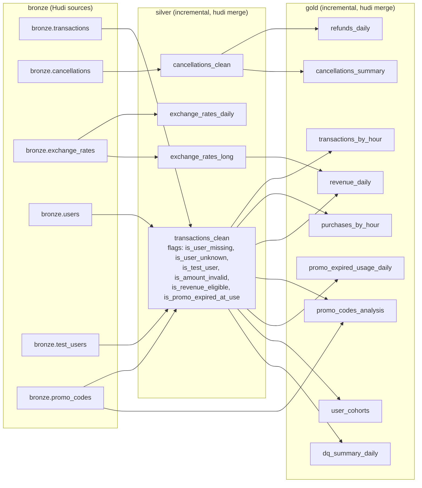
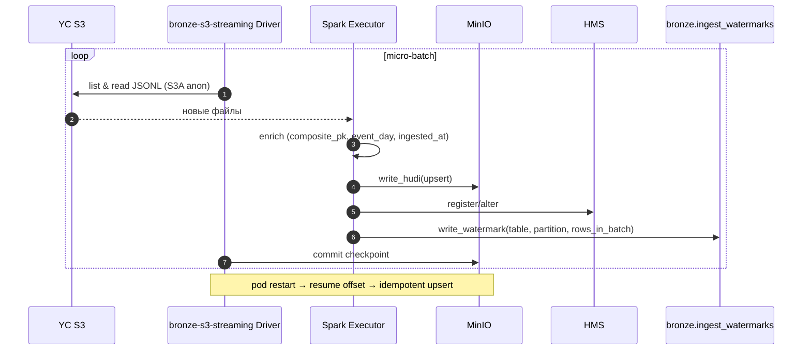
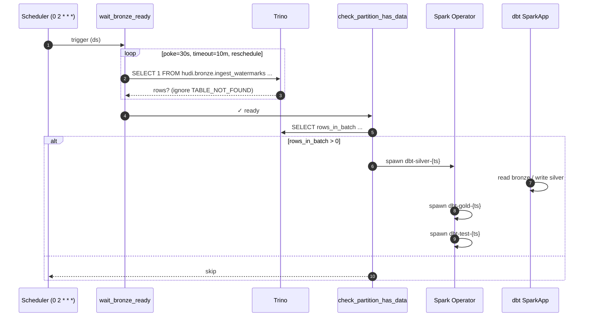
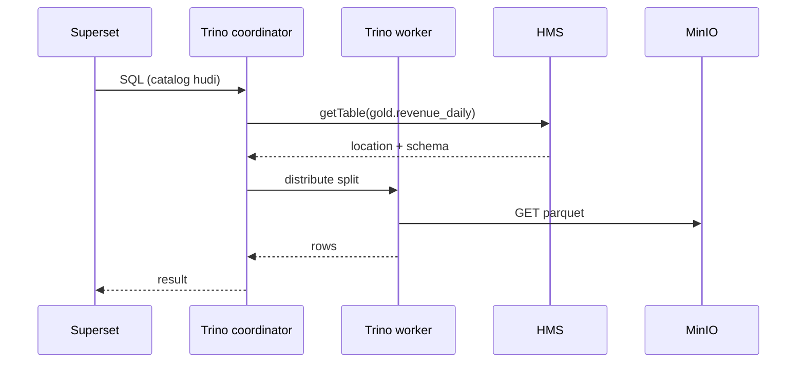

# Detailed Architecture: Lab08 — Транзакционная Аналитика

---

## 1. Введение

`lab08` — локально разворачиваемый Lakehouse end-to-end:

1. **Ingest:** YC S3 (`npl-de18-lab8-data`, JSONL, batch-файлы) и внешний Kafka.
2. **Хранение:** Apache Hudi (CoW) поверх MinIO в medallion-слоях `bronze/silver/gold`.
3. **Трансформации:** dbt-spark (`method: session`, incremental + Hudi `merge`).
4. **Каталог:** Hive Metastore (Postgres backend).
5. **Query/BI:** Trino 470 (read-only), Apache Superset 4.x.
6. **Оркестрация:** Airflow 2.10.4 (`KubernetesExecutor`); стриминг — долгоживущие `SparkApplication` CRD'ы.
7. **Observability:** kube-prometheus-stack, Spark Prometheus servlet, statsd-exporter для Airflow.

Всё разворачивается в Kubernetes (kind / Docker Desktop) декларативно через `helmfile.yaml` + raw-манифесты `k8s/`.

---

## 2. System Context (C4 L1)

---

## 3. Containers (C4 L2)

### 3.1 Стек

| Container | Версия | Namespace |
|---|---|---|
| ingress-nginx | 4.11.0 | `ingress-nginx` |
| MinIO Operator + Tenant | 6.0.4 | `minio-operator`, `storage` |
| HMS Postgres (Bitnami) | 15.5.38 | `data-platform` |
| Hive Metastore | 3.0.0 (raw manifest) | `data-platform` |
| Spark Operator | 1.4.6 | `data-platform` |
| Airflow | chart 1.15.0 (Airflow 2.10.4) | `data-platform` |
| Trino | chart 0.34.0 (v470) | `data-platform` |
| Superset | chart 0.13.2 (4.x) | `data-platform` |
| kube-prometheus-stack | 65.5.1 | `monitoring` |
| statsd-exporter | 0.13.0 | `monitoring` |

**Кастомные образы:** `lab08/spark:3.5.8-hudi-1.1.1` (Spark + Hudi + Hadoop S3A + Kafka + dbt-spark 1.8.0 + jobs); `lab08/airflow:2.10.4` (cncf-kubernetes, trino, statsd providers).

### 3.2 Протоколы

| От → К | Протокол / формат | Auth |
|---|---|---|
| Spark / Trino → MinIO | S3A HTTP / Parquet | secret `lab08-credentials` |
| Spark → YC S3 | S3A HTTPS / JSONL | Anonymous provider |
| Spark / Trino / dbt → HMS | Thrift | none (in-cluster) |
| HMS → Postgres | JDBC | `hive/hive` |
| Airflow → Spark Operator | K8s API (`SparkApplication` v1beta2) | SA `airflow` (RBAC `k8s/airflow-rbac.yaml`) |
| Airflow → Trino | HTTP REST | `trino_default` |
| Superset → Trino | HTTP REST | configured DB conn |
| Spark → Kafka | Kafka | env `KAFKA_BOOTSTRAP_SERVERS / KAFKA_TOPIC` |
| Prometheus → Spark | HTTP `/metrics/prometheus/` | none |
| Airflow → StatsD | UDP 9125 | none |

---

## 4. Components (C4 L3)

### 4.1 Spark streaming ingest (`spark-jobs/`)

**Свойства:** `restartPolicy: Always`, `onFailureRetries: 10`; чекпойнты на S3 → resume after pod kill; exactly-once на уровне файлов через checkpoint + Hudi upsert по `composite_pk`/PK; dynamic allocation `min=1, max=3`.

### 4.2 Airflow DAG `transactions_pipeline`

`start_date=2026-04-24`, `catchup=True`, `max_active_runs=1`. Каждая dbt-таска создаёт ephemeral `SparkApplication` (`restartPolicy.type: Never`); `mainApplicationFile=local:///opt/spark/jobs/run_dbt.py`; dbt-проект из ConfigMap `dbt-project` (mount `/tmp/cm`), код из `spark-jobs-code` (mount `/opt/spark/jobs`); AWS keys через `envSecretKeyRefs` (secret `lab08-credentials`).

### 4.3 dbt-проект (`dbt/`)

**Конфигурация:** `profile=lab08`, `dbt-spark` 1.8.0 `method: session`, `+materialized=incremental`, `+file_format=hudi`, `+incremental_strategy=merge`, `+location_root=s3a://lake/{silver,gold}`, `vars.base_currency=TGRK`. Hudi: `compression=zstd`, `clean.policy=KEEP_LATEST_COMMITS`, `commits.retained=2`, inline clustering на silver, column-stats index по `event_day, hour_of_day, is_test_user`.

**DQ:** ~30 generic dbt-тестов (`unique`, `not_null`, `accepted_values`) в `_silver.yml`, `_gold.yml`, `sources.yml` + 2 singular (recon bronze vs silver, orphan-rate cancellations).

---

## 5. Key Scenarios

### 5.1 Streaming ingest (S3 → bronze)

### 5.2 Daily transformation (Airflow + dbt)

### 5.3 Read path (Superset → Trino → Hudi)

---

