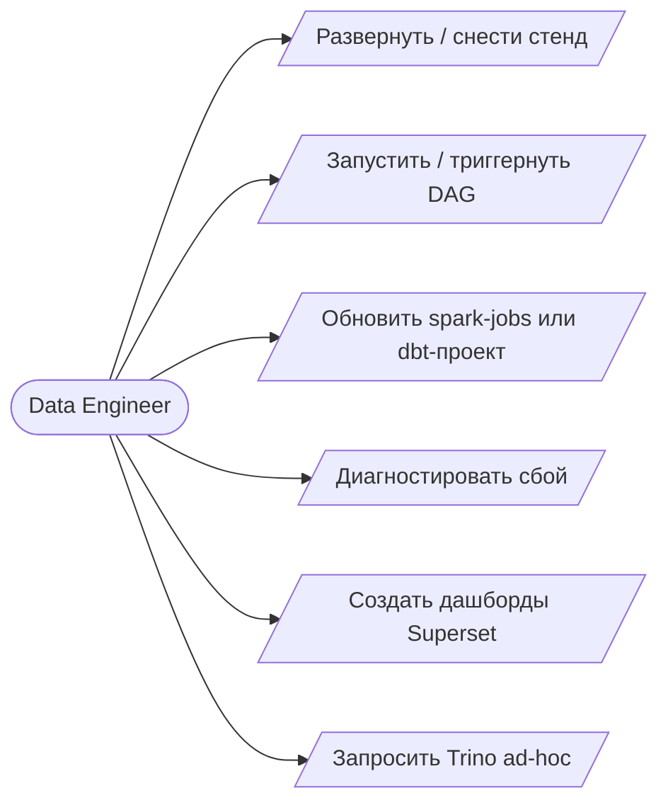

# Руководство пользователя

Lab08 — учебный стенд транзакционной аналитики, разворачиваемый локально командой `make up`. Данные поступают из YC S3 (посуточный batch, источник истины) и Kafka (опциональный speed-слой), сохраняются в Hudi-таблицы поверх MinIO, проходят через dbt и публикуются в дашбордах Superset.

Документ описывает повседневную работу со стендом. Устройство платформы — см. `01-detailed-architecture.md`.

Управление выполняется через `make`-таргеты в корне репозитория и веб-интерфейсы на `*.lab08.local`. Ручных операций в кластере не требуется.

---

## Первый запуск

### Предусловия

| Требование | Назначение |
|---|---|
| Docker Desktop с включённым Kubernetes, контекст `docker-desktop`, ≥ 16 GB RAM | основной runtime |
| `kubectl`, `helm`, `helmfile`, плагин `helm-diff` | управление кластером |
| Python 3.9+ | требуется для `make superset-init` |
| Креды S3 и Kafka в `k8s/secrets.yaml` (создаётся из `secrets.example.yaml`) | доступ к внешним источникам |
| `sudo` | требуется для `make hosts` (модифицирует `/etc/hosts`) |

### Установка

1. **Проверка окружения:** `make check`. Ожидается `kubectl OK / helm OK / helmfile OK / helm-diff OK` и список нод.
2. **Секреты:** `cp k8s/secrets.example.yaml k8s/secrets.yaml`, заполнить AWS- и Kafka-креды.
3. **Развёртывание:** `make up`. Таргет идемпотентный: сборка образов → helmfile sync → HMS → ConfigMap'ы → DAG'и → reference-batch → unpause → `bootstrap-pipeline`. Холодный старт занимает около 10 минут (MinIO Tenant, HMS на arm64 через QEMU, Airflow стартуют долго). `bootstrap-pipeline` ждёт первого наполнения gold-таблиц через Trino.
4. **DNS:** `make hosts` — добавляет `*.lab08.local` в `/etc/hosts`.
5. **Проверка состояния:** `make status`. Все pod'ы должны быть в статусе `Running` или `Completed`.
6. **Дашборды:** `make superset-init` — создаёт чарты и дашборд в Superset.

Kafka-стрим и streaming-medallion поднимаются `make up` автоматически. Если хочешь без NRT-слоя — пропусти `make kafka-streaming-app` и `make streaming-medallion-app`; batch-контур (bronze S3 + dbt + Superset settled) работает независимо.

Если `make up` падает на этапе HMS, следует подождать 5 минут и повторить запуск: Postgres и HMS на arm64 поднимаются медленно.

### Точки входа

| Сервис | URL | Логин |
|---|---|---|
| Airflow | http://airflow.lab08.local | admin / admin |
| Superset | http://superset.lab08.local | admin / admin |
| Trino | http://trino.lab08.local | — |
| MinIO | http://minio.lab08.local | minioadmin / … |
| Grafana | http://grafana.lab08.local | admin / admin |
| Prometheus | http://prometheus.lab08.local | — |

- **Airflow** — мониторинг DAG'ов `bronze_s3_ingest` и `transactions_medallion`, ручной триггер, логи задач.
- **Superset** — дашборд `Lab08 Transactions Overview` и SQL Lab.
- **Trino** — состояние запросов и worker'ов.
- **MinIO Console** — содержимое бакетов `lake/` и `checkpoints/`.
- **Grafana** — дашборд `lab08-overview` с метриками Spark и Airflow.
- **Prometheus** — сырые метрики и алерты.

---

## Роли и операции

В системе одна роль — **Data Engineer**. Multi-tenant ACL не предусмотрен (учебный стенд).



| Задача | Команда |
|---|---|
| Развернуть / снести | `make up` / `make down` |
| Дождаться готовности данных (после `make up`) | `make bootstrap-pipeline` |
| Триггернуть bronze-ingest | `make airflow-trigger-bronze` или Airflow UI |
| Триггернуть медальон | `make airflow-trigger-medallion` или Airflow UI |
| Перезапустить reference-batch | `make reference-batch` |
| Включить Kafka speed-слой | `make kafka-streaming-app` |
| Включить streaming-medallion (NRT gold) | `make streaming-medallion-app` |
| Обновить PySpark-код | правка `spark/*.py` → `make spark-code` (перезапуск стрима — вручную, см. ниже) |
| Обновить dbt | правка `dbt/` → `make dbt-configmap` |
| Создать дашборды | `make superset-init` |
| Ad-hoc SQL | Trino UI или Superset SQL Lab по `hudi.bronze.*`, `hudi.silver.*`, `hudi.gold.*` |

---

## Сценарии

### A. Развёртывание с нуля

Шаги совпадают с разделом «Установка» выше. При сбоях — см. раздел «Диагностика».

### B. Ручной запуск пайплайна

Цель — прогнать `bronze → silver → gold → tests` для конкретного `ds` (T-1).

1. Триггернуть bronze: `make airflow-trigger-bronze` либо «Trigger DAG» у `bronze_s3_ingest`. Внутри — `check_source_day` (ShortCircuit на наличие `day=<ds>/` в S3) → 3 параллельные таски `bronze_transactions / bronze_cancellations / bronze_exchange_rates`. Watermark пишет только transactions.
2. Триггернуть медальон: `make airflow-trigger-medallion` либо «Trigger DAG» у `transactions_medallion`. Сенсор `bronze_ready` (`reschedule`, poke 60s) ждёт watermark и запускает `dbt_silver → dbt_gold → dbt_test`.
3. По расписанию оба DAG'а запускаются автоматически: bronze в `0 2 * * *`, медальон в `30 2 * * *` (T-1 от текущего дня).

Если за `ds` нет данных в S3 — `bronze_s3_ingest` skipped (это легальный исход), медальон в этом случае упадёт по таймауту сенсора.

### C. Обновление кода

**PySpark (bronze batch jobs):**

1. Внести правки в `spark/jobs/*.py` или `spark/utils/*.py`.
2. `make spark-code` — пересоздаёт ConfigMap `spark-jobs-code`. Следующий DAGRun bronze поднимет новый driver с обновлённым кодом.

**PySpark (Kafka streaming, если запущен):**

1. `make spark-code`.
2. Перезапустить:
   ```bash
   kubectl -n spark-jobs delete sparkapplication bronze-kafka-ingest --ignore-not-found
   make kafka-streaming-app
   ```

**dbt:**

1. Внести правки в `dbt/models/` или `dbt/tests/`.
2. `make dbt-configmap` — пересоздаёт ConfigMap `dbt-project`.
3. Триггернуть медальон (`make airflow-trigger-medallion`). Следующий ephemeral `SparkApplication` подхватит обновлённый ConfigMap.

### D. Просмотр данных

Через Trino UI / CLI, каталог `hudi`:

```sql
SELECT * FROM hudi.gold.revenue_daily ORDER BY event_day DESC LIMIT 30;
SELECT count(*) FROM hudi.bronze.transactions;
SELECT * FROM hudi.bronze.ingest_watermarks_transactions ORDER BY committed_at DESC LIMIT 20;
```

В Superset — готовый дашборд `Lab08 Transactions Overview` или SQL Lab на том же каталоге.

### E. Снос стенда

`make down` — выполняет `helmfile destroy` и удаляет HMS. Для удаления данных MinIO — дополнительно `docker volume prune`.

При сносе PVC MinIO удаляется, все Hudi-таблицы пропадают. На следующем `make up` всё пересоздаётся, но значения `_ingested_at` будут новыми.

---

## Модель данных

### Слои (medallion)

- **bronze.*** — сырые данные плюс технические поля (`composite_pk`, `event_day`, `ingested_at`). Hudi upsert, exactly-once на уровне файлов через checkpoint.
- **silver.*** — типизация, дедуп, флаги качества: `is_user_missing`, `is_user_unknown`, `is_test_user`, `is_amount_invalid`, `is_revenue_eligible`, `is_promo_expired_at_use`.
- **gold.*** — settled-витрины: `transactions_by_hour`, `purchases_by_hour`, `revenue_daily`, `refunds_daily`, `cancellations_summary`, `promo_codes_analysis`, `promo_expired_usage_daily`, `user_cohorts`, `dq_summary_daily`. Пишутся dbt-ом за дни ≤ `s3_high_watermark`.
- **gold.*_live** — NRT-копии 3-х витрин + `exchange_rates_latest`, пишутся `streaming_medallion`. Дашборд видит обе стороны через Superset virtual dataset `gold.*_unified` (UNION с cutover-фильтром).

### Бизнес-правила

| Правило | Реализация |
|---|---|
| Дубли `transaction_id` (~5%) разрешаются через `composite_pk = concat_ws('|', transaction_id, created_at, user_id)` | bronze ingest, Hudi record_key |
| `is_test_user=true` исключаются из gold-витрин | silver и gold-фильтры |
| `is_revenue_eligible=false` (нулевые / отрицательные суммы, тестовые пользователи) не попадают в `revenue_daily` | silver |
| `is_promo_expired_at_use` — промокод применён после `expiry_date` | silver + `promo_expired_usage_daily` |
| Forward-fill курсов: `max(rate_day) <= event_day` | `gold.revenue_daily` |
| Late-arriving cancellations | `cancellations_clean` фильтрует по `date(ingested_at) = run_date`; gold-витрины по cancellations — `materialized='table'`, пересобираются целиком |
| Базовая валюта — `TGRK` | dbt `vars.base_currency` |

### Проверки качества

- ~30 generic dbt-тестов (`unique`, `not_null`, `accepted_values`).
- 2 singular: recon bronze vs silver count (drift > 5% → WARN) и `cancellations orphan_rate` (> 10% → WARN).
- Запускаются шагом `dbt_test` в DAG. Ручной запуск — `dbt test --vars '{run_date: ...}'` в driver pod.

---

## Диагностика

| Симптом | Решение |
|---|---|
| `make check` сообщает «Wrong context» | `kubectl config use-context docker-desktop` |
| Pod'ы HMS / Airflow в `Pending` или `CrashLoopBackOff` после `make up` | Подождать 5–10 минут (на arm64 через QEMU инициализация занимает много времени). Если не помогло — `kubectl -n data-platform logs <pod>` |
| `make up` падает на secrets | Не создан `k8s/secrets.yaml`. Создать из `secrets.example.yaml` |
| DAG на паузе | `make airflow-unpause` или кнопка в UI |
| `bronze_s3_ingest` skipped целиком | `check_source_day` не нашёл `day=<ds>/` в S3 — это легальный исход. Проверить YC bucket вручную |
| `transactions_medallion` упал на `bronze_ready` (timeout) | `bronze_s3_ingest` за тот же `ds` не отработал или skipped. Проверить его статус, при необходимости — clear + retrigger |
| Одна из bronze-тасок упала | `kubectl -n spark-jobs logs <driver-pod>`; clear таски в Airflow — upsert идемпотентен, дубли не появятся |
| Trino возвращает `TABLE_NOT_FOUND` | Первый ingest ещё не завершён. Дождаться `bronze_s3_ingest` за первый `ds` или выполнить `SHOW TABLES IN hudi.bronze` |
| `make superset-init` падает с auth error | Superset ещё инициализируется. Повторить через минуту; проверить `kubectl -n data-platform get pod -l app=superset` |
| `*.lab08.local` не открывается | Не выполнен `make hosts`. |
| Образы не собрались | Запустить поштучно: `make spark-image` / `make airflow-image` / `make hms-image`, проанализировать лог |
| Полный сброс | `make down` → `docker volume prune` → `make up` |

Полезные команды:

```bash
make status                   # pod'ы по всем namespaces
make diff                     # helmfile diff
make verify-trino             # smoke-тест Trino и bronze.transactions
kubectl -n spark-jobs get sparkapplication
kubectl -n spark-jobs logs <driver-pod>
```

---

## Глоссарий

| Термин | Определение |
|---|---|
| **Lakehouse** | Архитектура, в которой DWH-возможности (ACID, схема, time-travel) реализованы поверх объектного хранилища |
| **Hudi (CoW)** | Apache Hudi в режиме Copy-on-Write — каждая запись пересоздаёт parquet-файл |
| **Medallion** | Подход bronze (raw) → silver (cleaned) → gold (business marts) |
| **HMS** | Hive Metastore — каталог таблиц (schema, location) |
| **MinIO** | S3-совместимое хранилище. В Lab08 — бакеты `lake/` и `checkpoints/` |
| **Trino** | Distributed SQL engine, в Lab08 в режиме read-only с каталогом `hudi` |
| **Superset** | BI-инструмент, дашборды поверх Trino |
| **SparkApplication** | CRD `sparkoperator.k8s.io/v1beta2` от Kubeflow Spark Operator |
| **Streaming SparkApp** | Долгоживущий `SparkApplication` (`restartPolicy: Always`): `bronze-kafka-ingest` (Kafka → bronze) и `streaming-medallion` (bronze → `gold.*_live`) |
| **Batch SparkApp** | Эфемерный `SparkApplication` (`restartPolicy: Never`), создаётся Airflow на каждую задачу: bronze S3 batch, reference, dbt |
| **dbt-spark (session)** | Адаптер dbt, использующий уже сконфигурированный SparkSession в driver pod |
| **composite_pk** | `concat_ws('|', transaction_id, created_at, user_id)` — record key Hudi для транзакций, компенсирует дубли |
| **`_ingested_at`** | Технический timestamp, precombine-поле Hudi для dedup latest-wins |
| **bronze.ingest_watermarks_\<source\>** | Per-source Hudi commit-log, один writer на shard (`ingest_watermarks_transactions`, `_cancellations`, `_exchange_rates`, `_kafka`). На S3-shards завязан Airflow-сенсор |
| **TGRK** | Внутренний код базовой валюты конверсии, задан через `vars.base_currency` |
| **PythonSensor (reschedule)** | Airflow-сенсор, освобождающий worker-slot между poke-итерациями |
| **gold.\<x\>_unified** | Superset virtual dataset: UNION `gold.<x>` (settled, dbt) и `gold.<x>_live` (NRT, streaming), фильтр `event_day > max(settled)` |
| **ShortCircuitOperator** | Пропускает downstream-таски, если callable вернул `False` |
