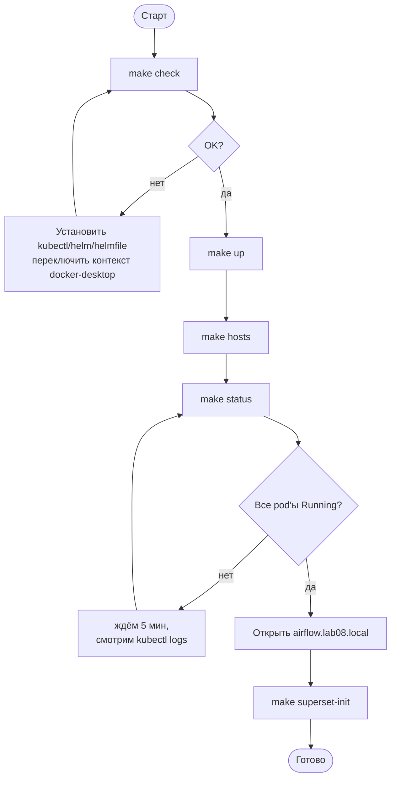
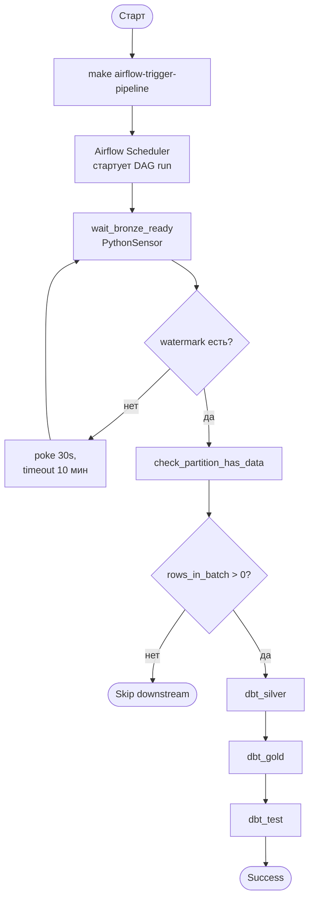

# User Guide: Lab08 — Транзакционная Аналитика

---

## 1. Введение

`lab08` — это учебная платформа транзакционной аналитики, которую один пользователь полностью разворачивает у себя локально одной командой `make up`. Платформа загружает финтех-данные из YC S3 и Kafka в Hudi-таблицы поверх MinIO, прогоняет их через dbt-трансформации и публикует дашборды в Superset.

Этот гайд — набор пошаговых задач: «развернуть», «проверить», «обновить», «диагностировать». Архитектура описана отдельно в `docs/01-detailed-architecture.md`.

> **NOTE.** Все взаимодействие — через `make`-таргеты в корне репозитория и веб-UI на `*.lab08.local`. Прямых правок в кластере вручную не требуется.

---

## 2. Getting Started

### 2.1 Предварительные требования

| Требование | Детали |
|---|---|
| Docker Desktop | Kubernetes включён, контекст `docker-desktop`, ≥ 16 GB RAM |
| CLI-утилиты | `kubectl`, `helm`, `helmfile`, плагин `helm-diff` |
| Python | 3.9+ (для `make superset-init`) |
| Доступы | креды для S3/Kafka — в `k8s/secrets.yaml` (создать из `secrets.example.yaml`) |
| `/etc/hosts` | `*.lab08.local` (добавляется через `make hosts`, нужен sudo) |

### 2.2 Первый запуск (happy path)

1. Проверить окружение → `make check` → ожидаем `kubectl OK / helm OK / helmfile OK / helm-diff OK` и список нод.
2. Создать секреты → `cp k8s/secrets.example.yaml k8s/secrets.yaml`, вписать AWS / Kafka креды.
3. Поднять платформу → `make up` → идемпотентная установка (images + helmfile sync + HMS + ConfigMap'ы + DAG'и + unpause).
   > Первый старт ~10 минут (MinIO Tenant, HMS на arm64 через QEMU, Airflow).
4. Прописать DNS → `make hosts` → `*.lab08.local` появляется в `/etc/hosts`.
5. Проверить, что всё запущено → `make status` → все pod'ы в `Running` / `Completed`.
6. Открыть UI:

| Сервис | URL | Логин |
|---|---|---|
| Airflow | http://airflow.lab08.local | admin / admin |
| Superset | http://superset.lab08.local | admin / admin |
| Trino | http://trino.lab08.local | — |
| MinIO | http://minio.lab08.local | minioadmin / … |
| Grafana | http://grafana.lab08.local | admin / admin |
| Prometheus | http://prometheus.lab08.local | — |

7. Создать дашборды → `make superset-init` → в Superset появляются 6 charts + 1 dashboard.

> **TIP.** `make up` безопасно перезапускать — таргет идемпотентный.

> **WARNING.** Если `make up` упал на этапе HMS, дайте кластеру 5 минут и запустите ещё раз — Postgres + HMS на arm64 стартуют долго.

### 2.3 Обзор интерфейсов

- **Airflow UI** — мониторинг DAG'а `transactions_pipeline`, ручной триггер, просмотр логов dbt-таcк.
- **Superset UI** — дашборды `Lab08 Transactions Overview`, ad-hoc SQL Lab.
- **Trino UI** — состояние queries, executors.
- **MinIO Console** — содержимое bucket'ов `lake/` (bronze/silver/gold) и `checkpoints/`.
- **Grafana** — дашборд `lab08-overview` (Spark / Airflow метрики из kube-prometheus-stack).
- **Prometheus** — raw-метрики и алерты.

---

## 3. Роли и доступ

В платформе одна роль — **Data Engineer (Operator)**. Multi-tenant ACL и фейс-контроль не реализованы (учебный стенд).


| Действие | Как |
|---|---|
| Развернуть / снести | `make up` / `make down` |
| Триггернуть DAG | Airflow UI «Trigger DAG» или `make airflow-trigger-pipeline` |
| Обновить PySpark-код | редактируем `spark-jobs/*.py` → `make spark-code` → `make streaming-apps` |
| Обновить dbt | редактируем `dbt/` → `make dbt-configmap` |
| Создать дашборды | `make superset-init` |
| Ad-hoc SQL | Trino UI / Superset SQL Lab → `hudi.bronze.*`, `hudi.silver.*`, `hudi.gold.*` |

---

## 4. Сценарии

### 4.1 Сценарий A — развернуть платформу с нуля

**Цель:** получить рабочий стенд за одну сессию.

**Предусловия:** выполнены требования из §2.1, `k8s/secrets.yaml` создан.



**Шаги:**

1. `make check` → `kubectl OK / helm OK / ...`
2. `cp k8s/secrets.example.yaml k8s/secrets.yaml` + редактирование → файл создан.
3. `make up` → последовательно: images → MinIO → buckets → DAG copy → helmfile sync → HMS → spark-code/dbt ConfigMap'ы → ingress → unpause DAG.
4. `make hosts` → строки `127.0.0.1 airflow.lab08.local …` в `/etc/hosts`.
5. `make status` → все pod'ы `Running` / `Completed`.
6. Открыть Airflow → DAG `transactions_pipeline` виден и не на паузе.
7. `make superset-init` → в Superset появляется dashboard.

**Возможные ошибки:** см. §6.

### 4.2 Сценарий B — запустить пайплайн вручную (полный прогон)

**Цель:** прогнать `bronze → silver → gold → tests` для текущего `data_interval_start`.

**Предусловия:** платформа развёрнута; стриминг (`bronze-s3-streaming`, `bronze-kafka-ingest`) работает; в `bronze.ingest_watermarks` есть строки.



**Шаги:**

1. Убедиться, что стримы работают → `kubectl -n spark-jobs get sparkapplication` → `bronze-s3-streaming` и `bronze-kafka-ingest` в `RUNNING`.
2. (Опционально) проверить наличие данных в bronze → `make verify-trino`.
3. Запустить DAG → `make airflow-trigger-pipeline` или Airflow UI → «Trigger DAG».
4. Открыть Graph view → `wait_bronze_ready → check_partition_has_data → dbt_silver → dbt_gold → dbt_test`.
5. Все таски — зелёные. Логи dbt доступны прямо в task-логах (driver pod).

> **TIP.** Sensor сам ждёт прихода данных — ручного триггера ingest не требуется.

### 4.3 Сценарий C — обновить код и применить

**Цель:** внести правку в `spark-jobs/*.py` или `dbt/` и протолкнуть в кластер без `make up`.

**Шаги (PySpark / streaming):**

1. Отредактировать `spark-jobs/bronze_s3_streaming.py` (или другой файл).
2. `make spark-code` → ConfigMap `spark-jobs-code` пересоздан.
3. Перезапустить нужный SparkApplication:
   ```bash
   kubectl -n spark-jobs delete sparkapplication bronze-s3-streaming --ignore-not-found
   make streaming-apps
   ```
4. `kubectl -n spark-jobs get pods -w` → новый driver `Running`, executors поднимаются.

**Шаги (dbt):**

1. Отредактировать модели в `dbt/models/...` или тесты в `dbt/tests/`.
2. `make dbt-configmap` → ConfigMap `dbt-project` пересоздан.
3. Запустить DAG (`make airflow-trigger-pipeline`) — следующая ephemeral SparkApplication подхватит новый ConfigMap.

### 4.4 Сценарий D — посмотреть данные в Trino / Superset

**Шаги:**

1. Trino UI или CLI → подключение catalog `hudi`.
2. Запросы:
   ```sql
   SELECT * FROM hudi.gold.revenue_daily ORDER BY event_day DESC LIMIT 30;
   SELECT count(*) FROM hudi.bronze.transactions;
   SELECT * FROM hudi.bronze.ingest_watermarks ORDER BY committed_at DESC LIMIT 20;
   ```
3. Superset → готовый dashboard `Lab08 Transactions Overview`, либо SQL Lab → тот же `hudi`.

### 4.5 Сценарий E — снести стенд

**Шаги:**

1. `make down` → `helmfile destroy` + удаление HMS.
2. (Опционально) `docker volume prune`, чтобы убрать данные MinIO.

> **WARNING.** PVC MinIO удаляется — все Hudi-таблицы пропадут. На следующий `make up` всё пересоздастся, но history `_ingested_at` будет новый.

---

## 5. Возможности и бизнес-правила

### 5.1 Слои данных (medallion)

- **bronze.*** — сырые данные + технические поля (`composite_pk`, `event_day`, `ingested_at`). Hudi upsert, exactly-once на уровне файлов через checkpoint.
- **silver.*** — типизация, дедуп, флаги качества (`is_user_missing`, `is_user_unknown`, `is_test_user`, `is_amount_invalid`, `is_revenue_eligible`, `is_promo_expired_at_use`).
- **gold.*** — витрины: `transactions_by_hour`, `purchases_by_hour`, `revenue_daily`, `refunds_daily`, `cancellations_summary`, `promo_codes_analysis`, `promo_expired_usage_daily`, `user_cohorts`, `dq_summary_daily`.

### 5.2 Бизнес-правила

| Правило | Где |
|---|---|
| Дубли `transaction_id` (~5%) → `composite_pk = concat_ws('|', transaction_id, created_at, user_id)` | bronze ingest, Hudi record_key |
| `is_test_user=true` исключаются из gold-витрин | silver + gold фильтры |
| `is_revenue_eligible=false` (нулевые/отрицательные суммы, тестовые юзеры) → не идут в `revenue_daily` | silver |
| `is_promo_expired_at_use` → промокод использован после `expiry_date` | silver + `promo_expired_usage_daily` |
| Forward-fill курсов: `max(rate_day) <= event_day` | `gold.revenue_daily` |
| Late-arriving cancellations | silver lookback 7 дней |
| Базовая валюта конверсии — `TGRK` | dbt `vars.base_currency` |

### 5.3 DQ-тесты

- ~30 generic dbt-тестов (`unique`, `not_null`, `accepted_values`).
- 2 singular: recon `bronze vs silver` count (drift > 5% = WARN), `cancellations orphan_rate` (> 10% = WARN).
- Запускается шагом `dbt_test` в DAG, либо вручную: `dbt test --vars '{run_date: ...}'` в driver pod'е.

---

## 6. Troubleshooting / FAQ

| Симптом | Причина / решение |
|---|---|
| `make check` выдаёт `Wrong context` | Переключить kubectl на `docker-desktop`: `kubectl config use-context docker-desktop`. |
| Pod'ы HMS / Airflow висят `Pending` или `CrashLoopBackOff` после `make up` | Дать 5–10 минут (HMS на arm64 через QEMU, Postgres init). Если не помогло — `kubectl -n data-platform logs <pod>`. |
| `make up` падает на secrets | Не создан `k8s/secrets.yaml`. Сделать из `k8s/secrets.example.yaml`. |
| DAG `transactions_pipeline` стоит на паузе | `make airflow-unpause` или кнопка в UI. |
| `wait_bronze_ready` всегда timeout-ит | Стрим `bronze-s3-streaming` не пишет в `bronze.ingest_watermarks`. Проверить: `kubectl -n spark-jobs logs bronze-s3-streaming-driver`, креды S3, доступ к YC bucket. |
| `dbt_silver` падает на Hudi timeline corruption | `make reset-watermarks` (сбрасывает watermark-таблицу) или для cancellations — `make reset-cancellations`. |
| Дубли в `bronze.cancellations` | `make reset-cancellations` — drop tables + clear stream checkpoint, следующий run пересоберёт. |
| Trino не видит таблицу (`TABLE_NOT_FOUND`) | Сенсор и `_trino_query_tolerant` это игнорируют; для ручных запросов — подождать первый успешный ingest или `SHOW TABLES IN hudi.bronze`. |
| `make superset-init` падает с auth error | Superset ещё стартует — повторить через минуту; либо проверить `kubectl -n data-platform get pod -l app=superset`. |
| `*.lab08.local` не открывается | Не выполнен `make hosts`; альтернатива — `make port-forward`. |
| Образы не собрались (`docker build` failed) | `make spark-image` / `make airflow-image` / `make hms-image` поштучно, посмотреть лог. |
| Полный сброс | `make down` → удалить docker volumes → `make up`. |

**Полезные команды:**

```bash
make status                   # pod'ы во всех namespaces
make diff                     # helmfile diff
make verify-trino             # проверка trino + bronze.transactions
kubectl -n spark-jobs get sparkapplication
kubectl -n spark-jobs logs <driver-pod>
```

---

## 7. Глоссарий

| Термин | Определение |
|---|---|
| **Lakehouse** | Архитектура, где DWH-возможности (ACID, schema, time-travel) реализованы поверх объектного хранилища. |
| **Hudi (CoW)** | Apache Hudi, формат таблиц Copy-on-Write — каждая запись пересоздаёт parquet-файл. |
| **Medallion** | Подход bronze (raw) → silver (cleaned) → gold (business marts). |
| **HMS** | Hive Metastore — каталог таблиц (schema, location). |
| **MinIO** | S3-совместимое хранилище. В лабе — buckets `lake/`, `checkpoints/`. |
| **Trino** | Distributed SQL engine, в лабе read-only, каталог `hudi`. |
| **Superset** | BI-инструмент, дашборды поверх Trino. |
| **SparkApplication** | CRD `sparkoperator.k8s.io/v1beta2` от Kubeflow Spark Operator. |
| **Streaming SparkApp** | Долгоживущая `SparkApplication` (`restartPolicy: Always`) — `bronze-s3-streaming`, `bronze-kafka-ingest`. |
| **dbt-spark (session)** | Адаптер dbt, использующий уже сконфигурированный SparkSession в driver pod'е. |
| **composite_pk** | `concat_ws('|', transaction_id, created_at, user_id)` — Hudi record key для транзакций (компенсирует дубли). |
| **`_ingested_at`** | Технический timestamp, precombine-поле Hudi для dedup latest-wins. |
| **bronze.ingest_watermarks** | Таблица-commit-log: `(table_name, source_partition, rows_in_batch, committed_at)`, на которой завязан Airflow sensor. |
| **TGRK** | Базовая валюта конверсии (внутренний код проекта), задаётся `vars.base_currency`. |
| **PythonSensor (reschedule)** | Airflow-сенсор, освобождающий worker-slot между poke-итерациями. |
| **ShortCircuitOperator** | Скипает downstream, если callable вернул `False`. |
