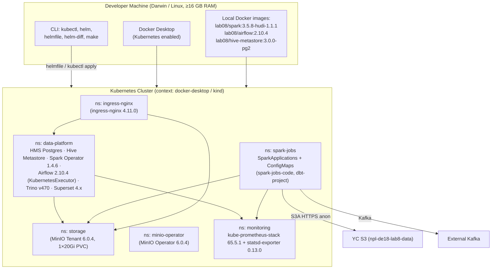
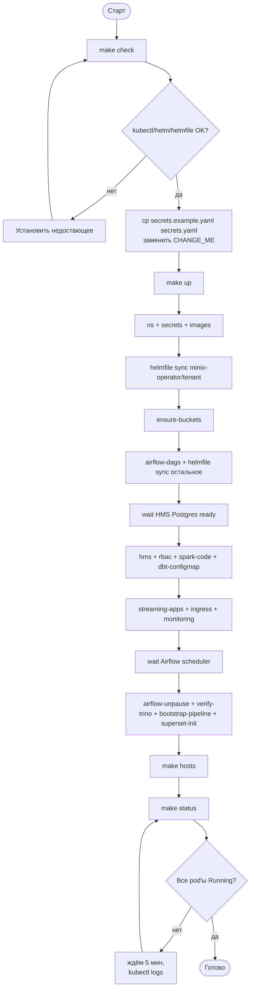
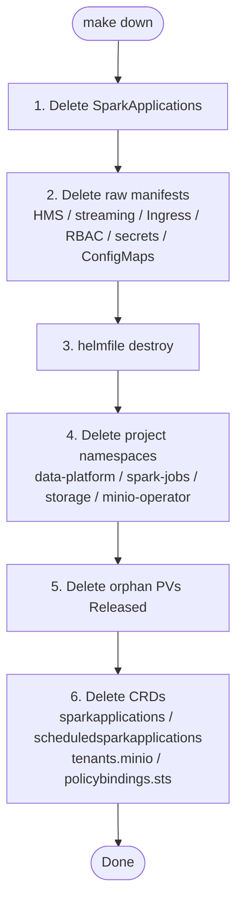

# Deployment Guide: Lab08 — Транзакционная Аналитика

- **Версия:** 1.0
- **Среда:** локальный Kubernetes (kind / Docker Desktop), single-environment (`dev`)
- **Целевая аудитория:** DevOps / Data Engineers, разворачивающие платформу
- **Связано с:** `docs/01-detailed-architecture.md`, `docs/02-user-guide.md`

---

## 1. Overview

Платформа разворачивается **декларативно** через `helmfile.yaml` + raw-манифесты `k8s/` + три кастомных Docker-образа. Один `Makefile` оркестрирует всё (`make up` / `make down`). Поддерживается одна целевая среда — локальный кластер (`docker-desktop` или `kind`); per-environment values отсутствуют.



---

## 2. Prerequisites

### 2.1 Hardware

| Компонент | CPU | RAM | Disk | Сеть |
|---|---|---|---|---|
| Docker Desktop / kind host | ≥4 vCPU | **≥16 GB выделено Docker'у** | ≥40 GB на образы и PVC | HTTPS наружу (YC S3, Helm repo, Docker Hub), доступ к внешнему Kafka |
| MinIO PVC | — | — | 20 Gi (1 pool × 1 server × 20Gi) | — |
| HMS Postgres | 100m / 500m | 256 Mi / 512 Mi | PVC default-StorageClass | — |
| Spark driver (streaming) | 1 / 1200m | 1 Gi + 256 Mi overhead | — | — |
| Spark executor (streaming) | 1 / 1200m | 2 Gi + 512 Mi overhead, instances 1–3 | — | — |
| Spark driver/executor (dbt) | 1 / 1200m | 1 Gi / 2 Gi (+overhead) | — | — |

### 2.2 Software

| Зависимость | Минимум | Рекомендуется |
|---|---|---|
| Docker Desktop (с включённым Kubernetes) | 4.x | 4.30+ |
| kubectl | 1.27 | 1.30+ |
| helm | 3.12 | 3.15+ |
| helmfile | 0.160 | 0.165+ |
| helm-diff plugin | 3.9 | latest |
| Python (для `make superset-init`) | 3.9 | 3.11 |
| make / bash / jq / sudo (для `make hosts`) | — | latest |

**Версии артефактов** (фиксированы в `helmfile.yaml` / `Dockerfile`'ах):

| Артефакт | Версия |
|---|---|
| `lab08/spark` | `3.5.8-hudi-1.1.1` |
| `lab08/airflow` | `2.10.4` |
| `lab08/hive-metastore` | `3.0.0-pg2` |
| ingress-nginx chart | `4.11.0` |
| minio-operator / tenant chart | `6.0.4` |
| bitnami/postgresql chart | `15.5.38` |
| spark-operator chart | `1.4.6` |
| apache-airflow chart | `1.15.0` (Airflow 2.10.4) |
| trino chart | `0.34.0` (Trino 470) |
| superset chart | `0.13.2` (Superset 4.x) |
| kube-prometheus-stack chart | `65.5.1` |
| prometheus-statsd-exporter chart | `0.13.0` |

### 2.3 Network

Все компоненты — внутри кластера; снаружи доступны через ingress-nginx по `*.lab08.local` (резолвится на `127.0.0.1` через `/etc/hosts`).

| Источник | Назначение | Порт | Протокол | Назначение |
|---|---|---|---|---|
| Любой namespace | `minio.storage.svc.cluster.local` | 80 | HTTP (S3A) | Объектное хранилище |
| Любой namespace | `hive-metastore.data-platform.svc:9083` | 9083 | Thrift | HMS |
| Spark driver | YC S3 `storage.yandexcloud.net` | 443 | HTTPS | Чтение JSONL (anonymous) |
| Spark driver | внешний Kafka | 9092 (или из secret) | Kafka | Поток событий |
| Airflow | `trino.data-platform.svc:8080` | 8080 | HTTP | Sensor SELECT |
| Superset | `trino.data-platform.svc:8080` | 8080 | HTTP | SQL |
| Prometheus | Spark driver pods | 4040+ | HTTP | `/metrics/prometheus/` |
| Airflow | `prometheus-statsd-exporter.monitoring.svc:9125` | 9125 | UDP | StatsD |
| Браузер пользователя | ingress-nginx | 80 | HTTP | `*.lab08.local` |

Хосты `/etc/hosts` (через `make hosts`): `airflow / superset / trino / s3 / minio / grafana / prometheus.lab08.local → 127.0.0.1`.

### 2.4 Service Accounts / RBAC

Ручные манифесты:

- `k8s/spark-rbac.yaml` — SA `spark` в ns `spark-jobs` (driver pods создают executors).
- `k8s/airflow-rbac.yaml` — права для SA Airflow на CRUD `SparkApplication`, чтение pod-логов в ns `spark-jobs`.

Helm-чарты создают свои SA (Spark Operator, Airflow, Trino, Superset, Prometheus и т.д.).

---

## 3. Configuration

### 3.1 Параметры приложения

Все параметры зафиксированы в `helm-values/*.yaml` и `k8s/*.yaml`. Изменения применяются через `helmfile sync` или `kubectl apply`.

| Параметр | Файл | Тип | Default | Назначение |
|---|---|---|---|---|
| `tenant.pools[0].size` | `helm-values/minio-tenant.yaml` | string | `20Gi` | Объём PVC MinIO |
| `tenant.buckets` | `helm-values/minio-tenant.yaml` | list | `lake, checkpoints, artifacts` | Создаваемые bucket'ы |
| `executor` | `helm-values/airflow.yaml` | enum | `KubernetesExecutor` | Тип executor'а Airflow |
| `airflowVersion` / `defaultAirflowTag` | `helm-values/airflow.yaml` | string | `2.10.4` | Версия Airflow |
| `extraEnv.AIRFLOW__METRICS__STATSD_*` | `helm-values/airflow.yaml` | env | `prometheus-statsd-exporter.monitoring:9125`, prefix `airflow` | StatsD-экспорт |
| `extraEnv.AIRFLOW__LOGGING__REMOTE_*` | `helm-values/airflow.yaml` | env | `s3://artifacts/airflow-logs` | Удалённые логи в MinIO |
| Hudi `+materialized` / `+file_format` / `+incremental_strategy` | `dbt/dbt_project.yml` | string | `incremental` / `hudi` / `merge` | Стратегия dbt-моделей |
| `vars.base_currency` | `dbt/dbt_project.yml` | string | `TGRK` | Базовая валюта конверсии |
| `restartPolicy` | `k8s/spark-applications/bronze-*.yaml` | object | `Always`, `onFailureRetries: 10` | Поведение стримов при сбое |
| `dynamicAllocation.{min,max}Executors` | `k8s/spark-applications/*.yaml` | int | `1 / 3` (s3), `1 / 2` (kafka) | Авто-скейлинг executors |
| `schedule` (DAG) | `airflow/dags/transactions_pipeline.py` | cron | `0 2 * * *` | Расписание трансформаций |
| `KIND_CONTEXT` | `Makefile` | env | `docker-desktop` | Текущий kubectl-context |

### 3.2 Secrets

> **WARNING.** Никогда не коммитьте реальные значения секретов. `k8s/secrets.yaml` есть в `.gitignore`; коммитится только `secrets.example.yaml`.

| Secret | Namespace | Поля | Где используется |
|---|---|---|---|
| `lab08-env-configuration` | `storage` | `MINIO_ROOT_USER`, `MINIO_ROOT_PASSWORD` | Init MinIO Tenant |
| `lab08-credentials` | `spark-jobs` | `AWS_ACCESS_KEY_ID`, `AWS_SECRET_ACCESS_KEY`, `AWS_ENDPOINT_URL`, `HMS_URIS`, `KAFKA_BOOTSTRAP_SERVERS`, `KAFKA_TOPIC` | Spark driver/executor (env via `envSecretKeyRefs`) |
| `minio-credentials` | `data-platform` | `AWS_ACCESS_KEY_ID`, `AWS_SECRET_ACCESS_KEY`, `AWS_ENDPOINT_URL` | Trino / Airflow для доступа к MinIO |

**Создание:** `cp k8s/secrets.example.yaml k8s/secrets.yaml`, заменить `CHANGE_ME` и `TODO_KAFKA_HOST`, `make secrets`.

### 3.3 Per-environment

Один environment (`dev`, локально). Per-env values **не реализованы** — все параметры берутся из единственного набора `helm-values/*.yaml`.

---

## 4. Installation



### 4.1 Шаги

1. **Проверить окружение.**
   ```bash
   make check
   ```
   Ожидаем: `kubectl OK / helm OK / helmfile OK / helm-diff OK`, список нод. Verify: `kubectl config current-context` = `docker-desktop` (или ваш `KIND_CONTEXT`).

2. **Создать секреты.**
   ```bash
   cp k8s/secrets.example.yaml k8s/secrets.yaml
   $EDITOR k8s/secrets.yaml      # заменить CHANGE_ME, TODO_KAFKA_HOST
   ```
   Verify: `grep -q CHANGE_ME k8s/secrets.yaml && echo "STILL HAS PLACEHOLDERS"` ничего не выводит.

3. **Запустить идемпотентную установку.**
   ```bash
   make up
   ```
   Ожидаемый вывод оканчивается баннером со списком URL'ов. Длительность холодного старта ~10 мин.

   Verify:
   ```bash
   make status
   kubectl -n data-platform get pods
   kubectl -n spark-jobs get sparkapplication
   ```
   Все pod'ы — `Running` / `Completed`; SparkApplications `bronze-s3-streaming` / `bronze-reference-batch` существуют.

4. **Прописать DNS.**
   ```bash
   make hosts
   ```
   Verify: `grep airflow.lab08.local /etc/hosts`.

5. **Проверить пайплайн.**
   ```bash
   make verify-trino
   ```
   Ожидаем `hudi.bronze.transactions OK` (после первого ingest, ~1–3 мин).

6. **Создать дашборды.**
   ```bash
   make superset-init
   ```
   Verify: открыть `http://superset.lab08.local`, dashboard `Lab08 Transactions Overview` присутствует.

> **NOTE.** `make up` идемпотентен: повторный запуск только пересинкронизирует helm-релизы и пере-применит ConfigMap'ы.

> **WARNING.** При первом старте на arm64 HMS поднимается через QEMU — наберитесь терпения. Если pod в `CrashLoopBackOff` дольше 10 минут, см. §8.

### 4.2 Доступные команды

| Команда | Назначение |
|---|---|
| `make help` | Список таргетов |
| `make images` | Сборка трёх Docker-образов (skip если уже есть) |
| `make spark-code` / `make dbt-configmap` | Пересоздать ConfigMap с кодом |
| `make streaming-apps` | Пере-применить streaming SparkApps |
| `make reference-batch` | Запустить one-shot bronze-reference-batch |
| `make airflow-dags` | Скопировать DAG-файлы в scheduler pod |
| `make airflow-trigger-pipeline` | Триггер DAG вручную |
| `make verify-trino` | Smoke-test Trino |
| `make diff` | `helmfile diff` |
| `make status` | `kubectl get pods` по всем ns |

---

## 5. Upgrade

Стратегия: **rolling-update через helmfile + декларативные манифесты**. Версии всех чартов и образов фиксированы; апгрейд = bump версии в `helmfile.yaml` / `Dockerfile` + `make up`.

**Шаги:**

1. Обновить версии:
   - чарта → `helmfile.yaml` (`version: ...`),
   - образа → `docker/<service>/Dockerfile` + теги во всех ссылках (`Makefile`, `helm-values/*.yaml`, `k8s/spark-applications/*.yaml`, `airflow/dags/transactions_pipeline.py:SPARK_IMAGE`).
2. Посмотреть, что изменится:
   ```bash
   make diff
   ```
3. Применить:
   ```bash
   make up
   ```
   `helmfile sync` обновляет release'ы по очереди (Deployment'ы — RollingUpdate, StatefulSet'ы — OrderedReady).
4. Verify: `make status`, `make verify-trino`, прогон DAG (`make airflow-trigger-pipeline`).

**Совместимость данных:**

- Hudi таблицы — формат стабильный в minor-версиях; major bump (1.x → 2.x) требует чтения CHANGELOG.
- HMS schema — изменения схемы Postgres решаются через MetaStore upgrade (вне скоупа).
- dbt-incremental модели поверх Hudi `merge` — backward-compatible при добавлении nullable-колонок.

> **NOTE.** Streaming SparkApps пересоздаются через `restartPolicy: Always` — после обновления образа удалите ресурс, `make streaming-apps` создаст заново; чекпойнт сохранится.

---

## 6. Rollback

**Когда откатывать:**

- `make up` оставил pod'ы в `CrashLoopBackOff` дольше 10 мин и логи указывают на новую версию.
- DAG `transactions_pipeline` валится после bump'а образа Spark на стадии `dbt_silver` / `dbt_gold`.
- `verify-trino` не находит таблицы после апгрейда чарта Trino / HMS.

**Шаги:**

1. Вернуть версии в `helmfile.yaml` / Dockerfile / манифесты к предыдущим значениям (используйте git: `git checkout <prev-sha> -- helmfile.yaml docker/ k8s/`).
2. Если нужно собрать предыдущий образ:
   ```bash
   docker build -t lab08/spark:3.5.8-hudi-1.1.1 docker/spark/
   ```
3. Применить:
   ```bash
   make up
   ```
   `helmfile sync` откатит releases. Альтернатива для конкретного релиза:
   ```bash
   helm -n data-platform history <release>
   helm -n data-platform rollback <release> <REVISION>
   ```
4. Streaming SparkApps:
   ```bash
   kubectl -n spark-jobs delete sparkapplication bronze-s3-streaming bronze-kafka-ingest --ignore-not-found
   make streaming-apps
   ```
   Чекпойнты на S3 переживают rollback — стримы возобновятся с прежнего offset'а.
5. Verify: `make status`, `make verify-trino`, прогон DAG.

> **WARNING.** Откат с потерей данных: `make down` удаляет PVC MinIO и базу HMS — все Hudi-таблицы и каталог метаданных пропадут.

---

## 7. Uninstall



**Команда:**

```bash
make down
```

**Что уйдёт:**

- Все pod'ы / Deployments / StatefulSets в `data-platform`, `spark-jobs`, `storage`, `minio-operator`.
- PVC и PV (включая данные MinIO и HMS Postgres → **Hudi-таблицы пропадут**).
- ConfigMap'ы `spark-jobs-code`, `dbt-project`, секреты `lab08-credentials`, `lab08-env-configuration`, `minio-credentials`.
- CRD: `sparkapplications.sparkoperator.k8s.io`, `scheduledsparkapplications`, `tenants.minio.min.io`, `policybindings.sts.min.io`.

**Что останется:**

- Namespace'ы `monitoring` и `ingress-nginx` (если нужны — удалить руками).
- Записи в `/etc/hosts` (удалить вручную, если нужно).
- Локальные Docker-образы `lab08/*` (удалить через `docker rmi`).

> **WARNING.** `make down` — деструктивная операция. Сделайте `mc cp` / `mc mirror` важных данных из MinIO заранее.

---

## 8. Troubleshooting

| Проблема | Возможная причина | Решение |
|---|---|---|
| `make check` → `Wrong context: expected docker-desktop` | Активен другой kubectl context | `kubectl config use-context docker-desktop` или установить `KIND_CONTEXT=<your-ctx> make check` |
| `make up` → ошибка `secrets.yaml not found` | Не создан файл секретов | `cp k8s/secrets.example.yaml k8s/secrets.yaml`, заполнить, `make secrets` |
| Pod HMS `CrashLoopBackOff` > 10 мин | Postgres ещё не готов / arm64 + QEMU медленный | `kubectl -n data-platform logs hive-metastore-0`; повторить `make up` через 5 мин |
| `bucket lake/ does not exist` в Spark logs | `ensure-buckets` не успел отработать | `make ensure-buckets`; проверить `kubectl -n storage get pod -l v1.min.io/tenant=lab08` |
| `bronze-s3-streaming` `Failed`, ошибки auth к YC S3 | Anonymous provider не сконфигурирован | Проверить `spark.hadoop.fs.s3a.bucket.npl-de18-lab8-data.aws.credentials.provider` в `bronze-s3-streaming.yaml` |
| `dbt_silver` падает: `Hudi timeline corrupted` | Несогласованный state после kill драйвера | `make reset-watermarks`; для cancellations — `make reset-cancellations` |
| `wait_bronze_ready` всегда timeout-ит | Streaming не пишет в `ingest_watermarks` | `kubectl -n spark-jobs logs <bronze-s3-streaming-driver>`; проверить креды S3, доступ к YC |
| Трино `TABLE_NOT_FOUND` | Первый ingest ещё не завершён | Подождать 1–3 мин; `SHOW TABLES IN hudi.bronze` |
| `make superset-init` → auth error | Superset ещё стартует | Повторить через 1 мин; `kubectl -n data-platform get pod -l app=superset` |
| `*.lab08.local` не открываются | Не выполнен `make hosts` | `make hosts` (требует sudo) |
| `make down` зависает на namespace `terminating` | CRD'ы Spark Operator/MinIO держат финализаторы | Дождаться (target тайм-аут 300s); если висит — `kubectl patch ns <ns> -p '{"metadata":{"finalizers":[]}}' --type=merge` |
| Полный сброс окружения | — | `make down` → `docker volume prune` → `make up` |
