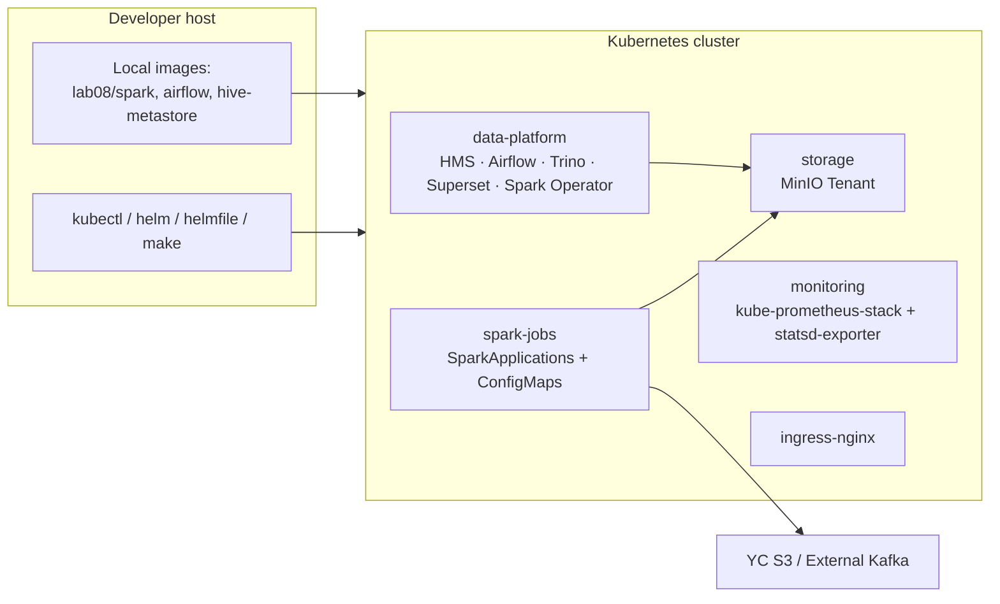
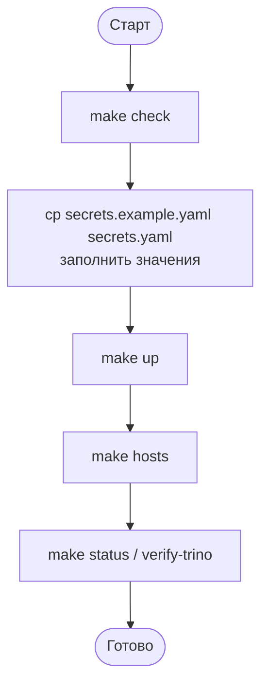

# Руководство по развертыванию

Документ описывает установку, обновление, откат и снос платформы.

## Подход

Развёртывание декларативное: `helmfile.yaml` плюс raw-манифесты в `k8s/` плюс три собственных Docker-образа. Поверх — единый `Makefile`, который оркестрирует все шаги (`make up` / `make down`). Среда одна — локальный кластер; per-environment values не предусмотрены.



---

## Требования

### Аппаратные

| Компонент | CPU | RAM | Диск | Сеть |
|---|---|---|---|---|
| Docker Desktop / kind host | ≥4 vCPU | **≥16 GB выделено Docker'у** | ≥40 GB на образы и PVC | HTTPS наружу (YC S3, Helm repo, Docker Hub), доступ к Kafka |
| MinIO PVC | — | — | 20 Gi (1 pool × 1 server) | — |
| HMS Postgres | 100m / 500m | 256 Mi / 512 Mi | PVC дефолтного StorageClass | — |
| Spark driver (streaming) | 1 / 1200m | 1 Gi + 256 Mi overhead | — | — |
| Spark executor (streaming) | 1 / 1200m | 2 Gi + 512 Mi overhead, 1–3 инстанса | — | — |
| Spark driver / executor (dbt) | 1 / 1200m | 1 Gi / 2 Gi (+overhead) | — | — |

### Программные

| Зависимость | Минимум | Рекомендуется |
|---|---|---|
| Docker Desktop с включённым Kubernetes | 4.x | 4.30+ |
| kubectl | 1.27 | 1.30+ |
| helm | 3.12 | 3.15+ |
| helmfile | 0.160 | 0.165+ |
| helm-diff plugin | 3.9 | latest |
| Python (для `make superset-init`) | 3.9 | 3.11 |
| make / bash / jq / sudo (для `make hosts`) | — | latest |

Версии артефактов зафиксированы в `helmfile.yaml` и `Dockerfile`:

| Артефакт | Версия |
|---|---|
| `lab08/spark` | `3.5.8-hudi-1.1.1` |
| `lab08/airflow` | `2.10.4` |
| `lab08/hive-metastore` | `3.0.0-pg2` |
| ingress-nginx chart | `4.11.0` |
| minio-operator / tenant chart | `6.0.4` |
| bitnami/postgresql chart | `15.5.38` |
| spark-operator chart | `1.4.6` |
| apache-airflow chart | `1.15.0` (Airflow 2.10.4) |
| trino chart | `0.34.0` (Trino 470) |
| superset chart | `0.13.2` (Superset 4.x) |
| kube-prometheus-stack chart | `65.5.1` |
| prometheus-statsd-exporter chart | `0.13.0` |

### Сетевые

Внутрикластерный трафик идёт напрямую через service DNS. Внешний доступ — через ingress-nginx на `*.lab08.local`, который резолвится в `127.0.0.1` через `/etc/hosts`.

| Источник → Назначение | Порт | Протокол | Назначение |
|---|---|---|---|
| Любой ns → `minio.storage.svc.cluster.local` | 80 | HTTP (S3A) | объектное хранилище |
| Любой ns → `hive-metastore.data-platform.svc:9083` | 9083 | Thrift | HMS |
| Spark driver → YC S3 `storage.yandexcloud.net` | 443 | HTTPS | чтение JSONL (anonymous) |
| Spark driver → Kafka | 9092 (или из secret) | Kafka | поток событий |
| Airflow → `trino.data-platform.svc:8080` | 8080 | HTTP | sensor SELECT |
| Superset → `trino.data-platform.svc:8080` | 8080 | HTTP | SQL |
| Prometheus → Spark driver pods | 4040+ | HTTP | `/metrics/prometheus/` |
| Airflow → `prometheus-statsd-exporter.monitoring.svc:9125` | 9125 | UDP | StatsD |
| Браузер → ingress-nginx | 80 | HTTP | `*.lab08.local` |

`make hosts` добавляет в `/etc/hosts` записи `airflow / superset / trino / s3 / minio / grafana / prometheus.lab08.local → 127.0.0.1`.

### Service Accounts / RBAC

Вручную применяются два манифеста:

- `k8s/spark-rbac.yaml` — SA `spark` в `spark-jobs` (драйверам требуется создавать executors).
- `k8s/airflow-rbac.yaml` — права SA Airflow на CRUD `SparkApplication` и чтение pod-логов в `spark-jobs`.

Остальные SA создаются helm-чартами (Spark Operator, Airflow, Trino, Superset, Prometheus).

---

## Конфигурация

Все параметры зафиксированы в `helm-values/*.yaml` и `k8s/*.yaml`. Изменения применяются через `helmfile sync` или `kubectl apply`.

### Основные параметры

| Параметр | Файл | Default | Назначение |
|---|---|---|---|
| `tenant.pools[0].size` | `helm-values/minio-tenant.yaml` | `20Gi` | объём PVC MinIO |
| `tenant.buckets` | `helm-values/minio-tenant.yaml` | `lake, checkpoints, artifacts` | список создаваемых бакетов |
| `executor` | `helm-values/airflow.yaml` | `KubernetesExecutor` | тип executor'а Airflow |
| `airflowVersion` / `defaultAirflowTag` | `helm-values/airflow.yaml` | `2.10.4` | версия Airflow |
| `extraEnv.AIRFLOW__METRICS__STATSD_*` | `helm-values/airflow.yaml` | `prometheus-statsd-exporter.monitoring:9125`, prefix `airflow` | экспорт метрик в StatsD |
| `extraEnv.AIRFLOW__LOGGING__REMOTE_*` | `helm-values/airflow.yaml` | `s3://artifacts/airflow-logs` | удалённые логи в MinIO |
| dbt Hudi defaults | `dbt/dbt_project.yml` | `incremental` / `hudi` / `merge` | стратегия dbt-моделей |
| `vars.base_currency` | `dbt/dbt_project.yml` | `TGRK` | базовая валюта конверсии |
| `restartPolicy` | `k8s/spark-applications/bronze-*.yaml` | `Always`, `onFailureRetries: 10` | поведение стримов при сбое |
| `dynamicAllocation.{min,max}Executors` | `k8s/spark-applications/*.yaml` | `1 / 3` (s3), `1 / 2` (kafka) | авто-скейл executors |
| `schedule` (DAG) | `airflow/dags/transactions_pipeline.py` | `0 2 * * *` | расписание трансформаций |
| `KIND_CONTEXT` | `Makefile` | `docker-desktop` | текущий kubectl-context |

### Секреты

Реальные значения секретов не коммитятся. `k8s/secrets.yaml` находится в `.gitignore`; в репозитории хранится только `secrets.example.yaml`.

| Secret | Namespace | Поля | Где используется |
|---|---|---|---|
| `lab08-env-configuration` | `storage` | `MINIO_ROOT_USER`, `MINIO_ROOT_PASSWORD` | инициализация MinIO Tenant |
| `lab08-credentials` | `spark-jobs` | `AWS_ACCESS_KEY_ID`, `AWS_SECRET_ACCESS_KEY`, `AWS_ENDPOINT_URL`, `HMS_URIS`, `KAFKA_BOOTSTRAP_SERVERS`, `KAFKA_TOPIC` | Spark driver / executor через `envSecretKeyRefs` |
| `minio-credentials` | `data-platform` | `AWS_ACCESS_KEY_ID`, `AWS_SECRET_ACCESS_KEY`, `AWS_ENDPOINT_URL` | Trino / Airflow для доступа к MinIO |

Создание: `cp k8s/secrets.example.yaml k8s/secrets.yaml`, заменить `CHANGE_ME` и `TODO_KAFKA_HOST`, выполнить `make secrets`.

### Per-environment

Реализован один environment — `dev`. Все параметры берутся из единого набора `helm-values/*.yaml`.

---

## Установка



`make up` внутри последовательно выполняет: создание namespaces и секретов, сборку образов, `helmfile sync`, инициализацию HMS, создание ConfigMap'ов, применение streaming SparkApps, unpause DAG'а и smoke-тесты.

### Пошагово

1. **Проверка тулинга.**
   ```bash
   make check
   ```
   Ожидаемый вывод: `kubectl OK / helm OK / helmfile OK / helm-diff OK` и список нод. Контекст должен совпадать с `KIND_CONTEXT` (по умолчанию `docker-desktop`).

2. **Секреты.**
   ```bash
   cp k8s/secrets.example.yaml k8s/secrets.yaml
   $EDITOR k8s/secrets.yaml      # заменить CHANGE_ME и TODO_KAFKA_HOST
   ```
   Проверка: команда `grep -q CHANGE_ME k8s/secrets.yaml && echo "STILL HAS PLACEHOLDERS"` не должна ничего выводить.

3. **Развёртывание.**
   ```bash
   make up
   ```
   В конце вывода печатается баннер с URL'ами. Холодный старт занимает около 10 минут.

   Проверка:
   ```bash
   make status
   kubectl -n data-platform get pods
   kubectl -n spark-jobs get sparkapplication
   ```
   Все pod'ы — `Running` или `Completed`; `SparkApplication`'ы `bronze-s3-streaming` и `bronze-reference-batch` присутствуют.

4. **DNS.**
   ```bash
   make hosts
   ```
   Проверка: `grep airflow.lab08.local /etc/hosts`.

5. **Smoke-тест.**
   ```bash
   make verify-trino
   ```
   После первого ingest (1–3 минуты) ожидается `hudi.bronze.transactions OK`.

6. **Дашборды.**
   ```bash
   make superset-init
   ```
   Проверка: в Superset (`http://superset.lab08.local`) присутствует дашборд `Lab08 Transactions Overview`.

`make up` идемпотентен — повторный запуск пересинхронизирует helm-релизы и пере-применит ConfigMap'ы. На arm64 HMS поднимается через QEMU длительно; если pod в `CrashLoopBackOff` дольше 10 минут — см. раздел «Диагностика».

### Полезные таргеты

| Команда | Назначение |
|---|---|
| `make help` | список таргетов |
| `make images` | сборка трёх Docker-образов (skip, если уже собраны) |
| `make spark-code` / `make dbt-configmap` | пересоздать ConfigMap с кодом |
| `make streaming-apps` | пере-применить streaming SparkApps |
| `make reference-batch` | one-shot bronze-reference-batch |
| `make airflow-dags` | скопировать DAG-файлы в scheduler pod |
| `make airflow-trigger-pipeline` | ручной триггер DAG |
| `make verify-trino` | smoke-тест Trino |
| `make diff` | `helmfile diff` |
| `make status` | `kubectl get pods` по всем ns |

---

## Обновление

Стратегия — rolling-update через helmfile и декларативные манифесты. Версии чартов и образов зафиксированы; апгрейд = bump версии в `helmfile.yaml` / `Dockerfile` и выполнение `make up`.

1. Обновить версии:
   - чарта — в `helmfile.yaml` (`version: ...`);
   - образа — в `docker/<service>/Dockerfile` и во всех ссылках на тег (`Makefile`, `helm-values/*.yaml`, `k8s/spark-applications/*.yaml`, `airflow/dags/transactions_pipeline.py:SPARK_IMAGE`).
2. Посмотреть изменения: `make diff`.
3. Применить: `make up`. `helmfile sync` обновляет releases поочерёдно (Deployment — RollingUpdate, StatefulSet — OrderedReady).
4. Проверить: `make status`, `make verify-trino`, прогон DAG через `make airflow-trigger-pipeline`.

**Совместимость данных:**

- Hudi-таблицы стабильны в minor-версиях; major bump (1.x → 2.x) требует анализа CHANGELOG.
- Изменения схемы HMS Postgres выполняются через MetaStore upgrade (вне скоупа Lab08).
- dbt-incremental поверх Hudi `merge` совместим вперёд при добавлении nullable-колонок.

Streaming SparkApps работают с `restartPolicy: Always`. После обновления образа ресурс удаляется, `make streaming-apps` создаёт его заново; checkpoint сохраняется.

---

## Откат

**Признаки, что требуется откат:**

- `make up` оставил pod'ы в `CrashLoopBackOff` дольше 10 минут, и в логах фигурирует новая версия.
- `transactions_pipeline` валится после bump образа Spark на `dbt_silver` / `dbt_gold`.
- `verify-trino` после апгрейда Trino или HMS не находит таблицы.

**Процедура:**

1. Вернуть версии в `helmfile.yaml` / Dockerfile / манифестах к предыдущим значениям:
   ```bash
   git checkout <prev-sha> -- helmfile.yaml docker/ k8s/
   ```
2. При необходимости — собрать предыдущий образ:
   ```bash
   docker build -t lab08/spark:3.5.8-hudi-1.1.1 docker/spark/
   ```
3. Применить: `make up`. `helmfile sync` откатит releases. Для отдельного релиза доступен точечный rollback:
   ```bash
   helm -n data-platform history <release>
   helm -n data-platform rollback <release> <REVISION>
   ```
4. Перезапустить streaming SparkApps:
   ```bash
   kubectl -n spark-jobs delete sparkapplication bronze-s3-streaming bronze-kafka-ingest --ignore-not-found
   make streaming-apps
   ```
   Чекпойнты на S3 переживают rollback — стримы возобновятся с того же offset.
5. Проверить: `make status`, `make verify-trino`, прогон DAG.

Откат с потерей данных — это `make down`: удаляет PVC MinIO и базу HMS, Hudi-таблицы и каталог метаданных пропадают.

---

## Снос

Команда:

```bash
make down
```

Внутри последовательно удаляются SparkApplications, raw-манифесты (HMS, streaming, Ingress, RBAC, секреты, ConfigMap'ы), helm-релизы (`helmfile destroy`), namespace'ы проекта, осиротевшие PV в статусе `Released` и CRD.

**Удаляется:**

- Все pod'ы, Deployments, StatefulSets в `data-platform`, `spark-jobs`, `storage`, `minio-operator`.
- PVC и PV, включая данные MinIO и HMS Postgres (**Hudi-таблицы пропадают**).
- ConfigMap'ы `spark-jobs-code`, `dbt-project`, секреты `lab08-credentials`, `lab08-env-configuration`, `minio-credentials`.
- CRD: `sparkapplications.sparkoperator.k8s.io`, `scheduledsparkapplications`, `tenants.minio.min.io`, `policybindings.sts.min.io`.

**Не удаляется:**

- Namespace'ы `monitoring` и `ingress-nginx` (при необходимости — удалить вручную).
- Записи в `/etc/hosts` (при необходимости — почистить вручную).
- Локальные образы `lab08/*` (удаляются через `docker rmi`).

Операция деструктивная. Если в MinIO есть важные данные — сохранить заранее через `mc cp` / `mc mirror`.

---

## Диагностика

| Проблема | Причина | Решение |
|---|---|---|
| `make check` → «Wrong context: expected docker-desktop» | активен другой kubectl-context | `kubectl config use-context docker-desktop` либо `KIND_CONTEXT=<ctx> make check` |
| `make up` → «secrets.yaml not found» | не создан файл секретов | `cp k8s/secrets.example.yaml k8s/secrets.yaml`, заполнить, `make secrets` |
| Pod HMS в `CrashLoopBackOff` > 10 минут | Postgres ещё не готов или arm64 + QEMU работает медленно | `kubectl -n data-platform logs hive-metastore-0`; повторить `make up` через 5 минут |
| В логах Spark `bucket lake/ does not exist` | `ensure-buckets` не отработал | `make ensure-buckets`; проверить `kubectl -n storage get pod -l v1.min.io/tenant=lab08` |
| `bronze-s3-streaming` падает с ошибкой auth к YC S3 | не настроен anonymous provider | проверить `spark.hadoop.fs.s3a.bucket.npl-de18-lab8-data.aws.credentials.provider` в `bronze-s3-streaming.yaml` |
| `dbt_silver` падает с «Hudi timeline corrupted» | рассинхронизация state после kill драйвера | `make reset-watermarks`; для cancellations — `make reset-cancellations` |
| `wait_bronze_ready` всегда тайм-аутит | стрим не пишет в `ingest_watermarks` | `kubectl -n spark-jobs logs <bronze-s3-streaming-driver>`; проверить креды S3 и доступ к YC |
| Trino → `TABLE_NOT_FOUND` | первый ingest ещё не завершён | подождать 1–3 минуты; `SHOW TABLES IN hudi.bronze` |
| `make superset-init` → auth error | Superset ещё инициализируется | повторить через минуту; `kubectl -n data-platform get pod -l app=superset` |
| `*.lab08.local` не открывается | не выполнен `make hosts` | `make hosts` (требует sudo) |
| `make down` зависает на namespace в `Terminating` | финализаторы Spark Operator / MinIO CRD | дождаться (тайм-аут 300s); при зависании — `kubectl patch ns <ns> -p '{"metadata":{"finalizers":[]}}' --type=merge` |
| Полный сброс окружения | — | `make down` → `docker volume prune` → `make up` |
